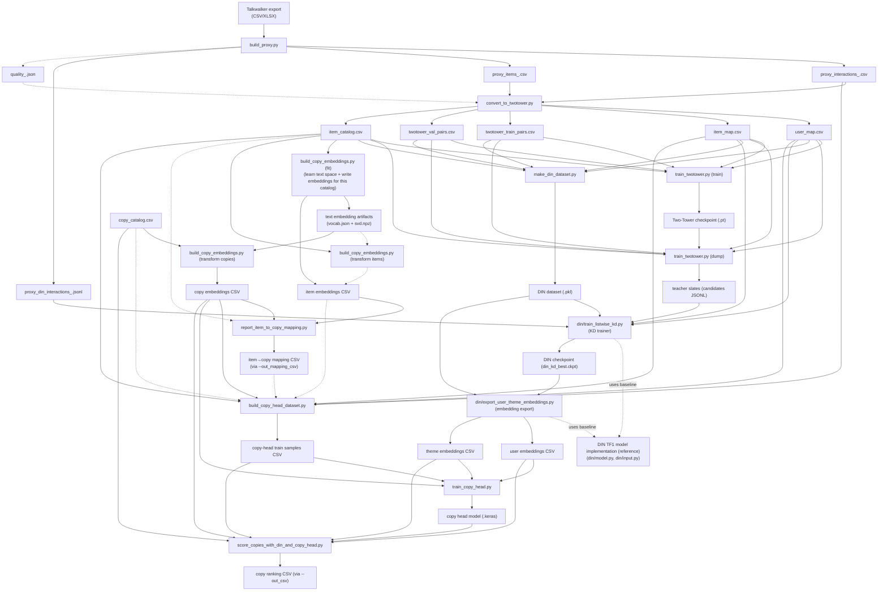

# Adgorithm Ad Creative Recsys Pipeline (Talkwalker proxy → Two‑Tower → DIN listwise KD → Ad Copy Scoring)

**Created by:** Brian Kim (Byungchan Kim), Alina Vasina  
**Affiliation:** Adgorithm Club at the University of Florida  
**Contact:** For questions about this project, reach out at bckim.contact@gmail.com.

**Team roles.**
- **Brian Kim (Team Lead).**
	- Built an end-to-end ad creative recsys pipeline: Talkwalker proxy → Two-Tower retrieval → DIN listwise KD → ad copy scoring.
	- Owned data contracts and reproducible artifacts (proxy schema, datasets, checkpoints) and end-to-end training + offline scoring tooling.
	- Implemented Two‑Tower training and candidate generation, plus DIN listwise KD (dataset construction, training loop, embedding export) for sequence-aware reranking.
- **Alina Vasina.**
	- Contributed to early-stage architecture discussions and literature review.
	- Supported the project through research material collection and feedback.

## 1. Executive Summary
### Goal & Outcomes
This repository implements an end-to-end creative recommendation pipeline designed for situations where **first‑party user logs are missing, sparse, or not directly usable**.

(Dependency graph & external requirements: see [§2.3](#23-dependency-graph--external-requirements).)

Instead of relying on real impression/click logs, the pipeline starts from **external observation data** (e.g., Talkwalker exports containing post/article text and engagement and exposure signals) and transforms it into a **consistent proxy interaction contract**. From that proxy contract, it trains and connects three modeling stages:

1) **Two‑Tower retrieval** (fast candidate generation)
2) **DIN listwise knowledge distillation (KD)** (sequence-aware re-ranking within teacher-provided candidate slates)
3) **Ad copy scoring** (implemented here as a lightweight *copy-head* model) to produce a global ranking over copy candidates

The core idea is not “predicting true CTR.” Instead, the pipeline produces a *useful, reproducible preference signal* by:
- Normalizing and stabilizing IDs and schemas so repeated runs are repeatable.
- Converting engagement-based observation metrics into **proxy labels** and **proxy features**.
- Using a scalable retrieval → distilled re-ranker → lightweight final head stack to rank copy candidates.

**What you get at the end**
- A **copy ranking CSV** (global ranking of copy candidates) that can be used as an offline ranking artifact.
	- If you want a single default pick from this run, a common convention is to start with the row where `rank == 1`.
- A set of intermediate datasets and trained checkpoints that make it possible to:
	- reproduce a run,
	- debug contract issues,
	- compare model versions and data versions.

**What to keep in mind while reading this README** (writer-side constraints reflected in the text)
- “User” in this pipeline can be a **pseudo-user** constructed from cohorts/sessions (not necessarily a real person).
- Labels named like `label_ctr_proxy` are *proxy signals* derived from engagement/composites, not true click CTR.
- Some artifacts are dense-index spaces (`user_idx`, `item_idx`) and some are string IDs (`user_id`, `item_id`); the pipeline is careful about this distinction.

### Key Artifacts
The pipeline intentionally produces “hard artifacts” (CSV/JSONL/checkpoints) between stages to make runs inspectable and reproducible.

Below is the canonical set of artifacts referenced by code. Many filenames are configurable via CLI flags; when in doubt, treat the **schema and join keys** as the real contract.

#### Stage 1 — Proxy (Talkwalker → proxy contract)
Generated by `build_proxy.py` into an output directory (default: `./proxy/`); output filenames include a timestamp tag.

- `proxy/proxy_items_<tag>.csv`
	- One row per deduplicated “item” (post/article).
	- Contains `item_id` (stable ID), `text`, and proxy features like `proxy_ctr_composite`, `proxy_recency`, etc.
- `proxy/proxy_interactions_<tag>.csv`
	- Interaction-like table with columns: `user_id`, `item_id`, `timestamp`, `label`, plus fields such as `engagement_total`.
	- This is the main input to the Two‑Tower conversion step.
- `proxy/proxy_din_interactions_<tag>.jsonl`
	- DIN-friendly JSONL with `timestamp` and per-event history fields (`hist_item_ids`, `hist_len`; may be empty).
	- Note: current `make_din_dataset.py` uses `timestamp` (when present) and rebuilds histories internally; it does not require the history fields to be precomputed.
- `proxy/quality_<tag>.json` (optional, enabled by default)
	- Lightweight data-quality summary (histogram stats, cohort stats, etc.).
- `proxy/auto_tune_report_<tag>.json` (optional, when `--auto_tune` is used)
	- Records auto-selected heuristics (labeling/cohort/pseudo-user decisions) for reproducibility.

#### Stage 1 — ID Universe + Two‑Tower input contract
Generated by `convert_to_twotower.py` into an output directory (default: `./twotower_data/`).

- `twotower_data/user_map.csv`
	- Mapping: `user_id` (string) → `user_idx` (dense int in `[0..N-1]`).
- `twotower_data/item_map.csv`
	- Mapping: `item_id` (string) → `item_idx` (dense int in `[0..M-1]`).
- `twotower_data/twotower_train_pairs.csv`, `twotower_data/twotower_val_pairs.csv`
	- Pairwise training tables with columns: `user_idx`, `item_idx`, `label`.
- `twotower_data/item_catalog.csv`
	- Item table keyed by `item_idx` with optional numeric proxy features.
	- Also includes split-safe recency columns when computable: `proxy_recency_train[_n]`, `proxy_recency_val[_n]`.
- `twotower_data/twotower_autoconfig.json`, `twotower_data/train_suggest.json` (optional, when `--auto_config` is used)
	- Suggested/derived conversion and training parameters.

#### Stage 1 — Two‑Tower model + teacher candidate slates
Generated by `train_twotower.py` (PyTorch).

- `twotower_runs/twotower_best.pt` (optional; when `--save_best` is set)
	- Saved model bundle containing weights and metadata (including item-feature normalization stats).
- `twotower_runs/twotower_final.pt` (optional; when `--save_final` is set)
	- Saved final model bundle.
- `twotower_runs/metrics.jsonl` (optional; when `--save_metrics` is set)
	- Training/evaluation metrics per epoch.
- `tt_candidates_topK.jsonl` (optional in the trainer; required for DIN KD (listwise))
	- Produced when `--dump_candidates_k > 0`.
	- Teacher candidate slates used by `din/train_listwise_kd.py`.
	- Each line contains `user_idx`, `candidate_item_idx[]`, `candidate_scores[]`, plus optional original IDs.
- `twotower_runs/user_emb.npy`, `twotower_runs/item_emb.npy` (optional, when `--export_embeddings` is set)

#### Stage 2 — DIN dataset + KD checkpoint (TensorFlow 1.x-style via `tf.compat.v1`)
Generated by `make_din_dataset.py` and `din/train_listwise_kd.py`.

- `din/dataset.pkl` (path is configurable)
	- A pickled dataset payload used by DIN.
	- Can be created from:
		- `twotower_train_pairs.csv`/`twotower_val_pairs.csv` (note: may not contain timestamps), or
		- `proxy_din_interactions_*.jsonl` (timestamps preserved; history fields optional)
- `din_kd_runs/din_kd_best.ckpt` (directory is configurable)
	- Best checkpoint saved by DIN KD (listwise) training.
	- “Best” selection is based on training total loss (as implemented), not necessarily a validation metric.

#### Stage 2 → Stage 3 bridge — exported embeddings

- `user_embeddings.csv`, `theme_embeddings.csv` (default names; configurable)
	- Columns: an integer ID column (`user_id` / `theme_id`) and embedding columns prefixed with `emb_`.
	- These IDs are **embedding row indices** (dense indices), not the original string IDs from Talkwalker.

#### Stage 3 — Ad copy scoring (copy embeddings, item↔copy mapping, copy-head training) and final ranking

- Copy embeddings (TF‑IDF + SVD)
	- Generated by `build_copy_embeddings.py`.
	- Artifacts (created in `--mode fit`):
		- `<artifact_prefix>.vocab.json`
		- `<artifact_prefix>.svd.npz`
	- Embedding output (both fit and transform):
		- `copy_embeddings.csv` (default; configurable), with columns: `copy_id` + `emb_*`
- Item → copy mapping (text-space nearest neighbor)
	- Reported / optionally saved by `report_item_to_copy_mapping.py`.
	- Optional CSV contract: `item_idx, copy_id, sim, sim_gap`.
- Copy-head training samples
	- Built by `build_copy_head_dataset.py`.
	- Output CSV columns typically include `user_id`, `theme_id`, `copy_id`, `label` and optionally `sample_weight`.
	- “Positive” is defined by thresholds over label and/or engagement fields.
- Copy-head model
	- Trained by `train_copy_head.py` and saved as a Keras model file (e.g., `copy_head.keras`).
- Final ranking
	- Produced by `score_copies_with_din_and_copy_head.py`.
	- Output is an optional ranking CSV written only when `--out_csv` is provided.

Key invariants:

- **Everything becomes a stable index space early** (`user_idx`, `item_idx`).
- DIN and copy-head stages consume **embedding tables keyed by dense indices**.
- `build_proxy.py` creates **string IDs** (`user_id`, `item_id`); `convert_to_twotower.py` freezes the dense integer spaces.

### Pipeline Snapshot

```
Talkwalker export (CSV/XLSX)
	└─ build_proxy.py
			├─ proxy_items_<tag>.csv
			├─ proxy_interactions_<tag>.csv
			└─ proxy_din_interactions_<tag>.jsonl (+ optional quality/auto_tune reports)

proxy_interactions_<tag>.csv + proxy_items_<tag>.csv
	└─ convert_to_twotower.py
			├─ user_map.csv / item_map.csv  (string ID → dense index)
			├─ twotower_train_pairs.csv / twotower_val_pairs.csv
			└─ item_catalog.csv

twotower_* + maps (+ optional item_catalog features)
	└─ train_twotower.py
			├─ twotower_best.pt (if `--save_best`)
			├─ metrics.jsonl (if `--save_metrics`)
			└─ tt_candidates_topK.jsonl (if `--dump_candidates_k > 0`; required for DIN KD)

DIN dataset
	└─ make_din_dataset.py
			└─ din/dataset.pkl

din/dataset.pkl + tt_candidates_topK.jsonl
	└─ din/train_listwise_kd.py
			└─ din_kd_runs/din_kd_best.ckpt

din_kd_best.ckpt + din/dataset.pkl
	└─ din/export_user_theme_embeddings.py
			├─ user_embeddings.csv
			└─ theme_embeddings.csv

item_catalog.csv + copy_catalog.csv (or any two CSVs with id/text columns)
	└─ build_copy_embeddings.py (fit on one side, transform the other)
			├─ copy_embedding_artifacts.{vocab.json,svd.npz}
			├─ item_embeddings.csv
			└─ copy_embeddings.csv


item_embeddings + copy_embeddings (required for nearest-text item→copy mapping; the report/persist step below is optional)
	└─ report_item_to_copy_mapping.py
			└─ item_to_copy_map.csv (optional)


proxy_interactions + maps + item_catalog + (one of: nearest-text mapping via item/copy embeddings (recommended) OR a precomputed item→copy mapping CSV OR direct mapping via copy_catalog (only if ID-universe match is verified))
	└─ build_copy_head_dataset.py
			└─ copy head training samples CSV

copy head samples + (user/theme/copy) embeddings
	└─ train_copy_head.py
			└─ copy_head.keras (default)

copy_head.keras (or whatever you saved via --out_model) + embeddings + samples
	└─ score_copies_with_din_and_copy_head.py
			└─ (optional) ranking CSV (filename/path set by `--out_csv`; e.g., `final_ranking.csv`)
```

## 2. System Architecture
### 2.1 Component Overview
This pipeline is intentionally modular: each step produces a small number of inspectable artifacts (CSV / JSONL / checkpoints) that become the input contracts for the next step.

At a high level, there are three “modeling layers” and several “contract layers” around them:

- **Contract Layer A — Proxy interaction contract**: turns external observation data into an interaction-like table.
- **Contract Layer B — DIN dataset contract**: creates `dataset.pkl` with histories and categorical/theme tables.
- **Model Layer 2 — DIN listwise KD (student)**: learns a sequence-aware re-ranker by imitating teacher slates.
- **Contract Layer C — Embedding export**: materializes user/theme embeddings as CSV tables for TF2/Keras.
- **Model Layer 3 — Ad copy scoring (copy head) + global scoring**: produces proxy-supervised copy ranking scores and a final global ranking.

Below is the concrete mapping from repo scripts to architectural components.

#### A) Proxy Builder (Talkwalker → proxy contract)
**Script:** `build_proxy.py`

**Responsibility**
- Normalizes messy external exports into stable, reproducible tables.
- Generates stable IDs and a pseudo-user strategy so downstream steps operate in a consistent “user/item universe.”
- Derives proxy labels and numeric proxy features from engagement signals.
- Emits a DIN-friendly JSONL with per-event history fields (may be empty).

- Produces a stable `item_id` using a hash over either URL (if present) or a (domain, normalized text snippet, date) fallback.
- Builds `user_id` via `--pseudo_user_mode` (`cohort`, `session`, or `mixed`).
- Produces two label concepts:
	- `label`: derived from `engagement_total` using either threshold or quantile logic (optionally group-normalized).
	- `label_ctr_proxy`: derived from a composite score `proxy_ctr_composite` (a weighted, re-normalized combination of volume/eng_rate/sentiment/recency proxies).

#### B) Index Space & Two‑Tower Dataset Conversion
**Script:** `convert_to_twotower.py`

**Responsibility**
- Freezes the canonical dense index spaces used by all subsequent embedding-table operations.
- Produces the minimal pair tables the Two‑Tower trainer consumes.

**Key implementation details**
- Requires interactions to contain `user_id`, `item_id`, `timestamp` plus a label column (`label` or `label_ctr_proxy`).
- Creates:
	- `user_map.csv` (string `user_id` → int `user_idx`)
	- `item_map.csv` (string `item_id` → int `item_idx`)
- Splits train/val by time (globally or per-user chrono split), then performs negative sampling for training.
- Writes `item_catalog.csv` keyed by `item_idx`, optionally enriched with split-safe recency variants.

#### C) Two‑Tower Retrieval (Teacher)
**Script:** `train_twotower.py`

**Responsibility**
- Trains a dot-product retrieval model over `(user_idx, item_idx)`.
- Produces teacher candidate slates for DIN KD: Top‑K item indices and their teacher scores per user.

**Model shape (from code)**
- User embedding table + item embedding table.
- Optional numeric item features (from `item_catalog.csv`) are passed through an MLP and combined with item embeddings (sum or concat+projection).
- Training objective: pointwise BCE on logits (with optional embedding regularization).

**Teacher slate output**
- The KD stage consumes `tt_candidates_topK.jsonl` lines with:
	- `user_idx`
	- `candidate_item_idx[]`
	- `candidate_scores[]` (either dot scores or sigmoid scores, depending on `--dump_score_type`)

#### D) DIN Dataset Builder (Contract)
**Script:** `make_din_dataset.py`

**Responsibility**
- Converts either pair tables or proxy JSONL into the legacy DIN pickle format `dataset.pkl`.

**What `dataset.pkl` contains**
- `train_set`, `test_set`: event-level examples with per-user histories
- `cate_list`, `theme_list`: per-item categorical/theme tables aligned to `item_idx`
- `(n_users, n_items, cate_count, theme_count)` metadata

**Why this exists**
- The DIN implementation in this repo is a TF1-style graph model expecting a specific pickle payload.

#### E) DIN Listwise KD Trainer (Student)
**Script:** `din/train_listwise_kd.py`
**Responsibility**
- Trains a sequence-aware model (DIN) to imitate the teacher’s Top‑K distribution for each user.

**How KD is wired (from code)**
- KD trainer provides `cand_ids` (Top‑K indices) and a teacher distribution `teacher_q` built from teacher scores and a temperature-like scaling `tau`.
- The total loss is a weighted mixture of:
	- KD loss (KL divergence) against the teacher distribution,
	- listwise CE over positives if positives are available,
	- plus the DIN model’s original pointwise BCE loss (weighted by `--point_loss_weight`).

#### F) Embedding Export (DIN → tables for TF2/Keras)
**Script:** `din/export_user_theme_embeddings.py`

**Responsibility**
- Exports `user_emb_w` and `theme_emb_w` from the DIN checkpoint into CSV tables with `emb_*` columns.

**Key architectural constraint**
- The exported `user_id` / `theme_id` in these CSVs are embedding row indices (dense integer IDs), and they must align with the IDs used when building copy-head samples.

#### G) Text Embedding Builder (Copy embeddings)
**Script:** `build_copy_embeddings.py`

**Responsibility**
- Builds a lightweight text embedding space using TF‑IDF + TruncatedSVD.
	- `fit`: learns vocab/IDF/SVD components and writes artifacts.
	- `transform`: projects new text rows into the already learned space.

**Practical note**
- The TF‑IDF tokenizer used here is regex-based and is most effective for Latin/ASCII-like tokens.

**Why this matters for the architecture**
- Item texts and copy texts can be embedded into the same vector space (if projected with the same artifacts), enabling item→copy mapping by cosine similarity.
- In practice, this means:
	- then run `build_copy_embeddings.py --mode transform` on `twotower_data/item_catalog.csv` (e.g., `--id_col item_idx --text_col text`) with the same `--artifact_prefix` to produce `item_embeddings.csv`.

#### H) Item ↔ Copy Bridge (nearest text mapping)
**Script:** `report_item_to_copy_mapping.py`

**Responsibility**
- Computes cosine similarity between item embeddings and copy embeddings.
- Reports mapping quality statistics (and can optionally persist the mapping as a CSV).

**Optional**
- You do not need to run this script for training/scoring.
	- The copy-head dataset builder can do nearest-text mapping directly.
	- Run this mainly to inspect mapping quality and/or persist an `item_to_copy_map.csv` so you can filter by `sim`/`sim_gap`.

#### I) Copy‑Head Dataset Builder (supervised samples)
**Script:** `build_copy_head_dataset.py`

**Responsibility**
- Turns proxy interactions into supervised samples over `(user_id, theme_id, copy_id)`.
- Supports two mapping strategies from item to copy:
	- `direct`: use an explicit mapping from a copy catalog.
	- `nearest_text`: map each item to the nearest copy in embedding space.
	- Recommended default: `nearest_text`. Use `direct` only when you have verified the ID universe match.
- Positives are selected by thresholds over one or more columns (e.g., by `label` and/or `engagement_total`).
- Negatives are generated by sampling other copies (`--num_neg_per_pos`).
- Optionally adds `sample_weight`.

#### J) Copy‑Head Model (TF2/Keras)
**Scripts:** `train_copy_head.py`, `copy_head_model.py`

**Responsibility**
- Trains a small MLP to predict whether a given `(user_emb, theme_emb, copy_emb)` triple is positive.

**Model shape (from code)**
- Inputs: `user_emb`, `theme_emb`, `copy_emb`.
- Computes `delta = copy_emb - theme_emb`, then concatenates `[user_emb, theme_emb, delta]`.
- MLP over that concatenated vector → sigmoid probability.

#### K) Global Copy Scoring (operational output)
**Script:** `score_copies_with_din_and_copy_head.py`

**Responsibility**
- Produces the final global copy ranking by:
	1) building per-theme “contexts” from training positives (weighted average of user embeddings),
	2) scoring every copy under each theme context using the copy-head model,
	3) aggregating scores across themes using a smoothed weighting scheme.

This is the stage that emits the final ranking artifact (CSV if `--out_csv` is provided).

**How to use the output**
- If you want a single default pick from the global ranking, start with the `rank == 1` row in the ranking CSV you wrote (e.g., `final_ranking.csv`).
- This ranking is **global** (aggregated across themes via weighted mixing); it is not intended to be per-user personalized.

### 2.2 Data Flow by Step
This section describes the data flow as a sequence of contracts. Each step lists:
- **Input contract** (files + required columns),
- **Output contract** (files + key columns),
- **Join keys / invariants** (what must align to avoid silent mismatches).

#### Step 1 — External export → proxy tables
**Input**
- Talkwalker export file: CSV or XLSX (see `build_proxy.py` loader).

**Processing (high level)**
- Column normalization (snake_case), text assembly, timestamp parsing.
- Stable `item_id` creation.
- Pseudo-user assignment.
- Proxy feature computation (`proxy_*`) and label computation (`label`, `label_ctr_proxy`).
- Per-event history construction for DIN JSONL.

**Outputs**
- `proxy_items_<tag>.csv`: keyed by `item_id`.
- `proxy_interactions_<tag>.csv`: interaction-like table keyed by (`user_id`, `item_id`, `timestamp`).
- `proxy_din_interactions_<tag>.jsonl`: per-event JSON objects containing `hist_item_ids` and `hist_len`.

**Key invariant**
- `item_id` and `user_id` here define the semantic universe from which all later dense indices are derived.

#### Step 2 — Proxy IDs → dense index universe
**Input**
- `proxy_interactions_<tag>.csv` must contain `user_id`, `item_id`, `timestamp` and one of the label columns.
- `proxy_items_<tag>.csv` must contain `item_id`.

**Outputs** (written to `twotower_data/` by default)
- `user_map.csv` (`user_id` → `user_idx`)
- `item_map.csv` (`item_id` → `item_idx`)
- `twotower_train_pairs.csv` / `twotower_val_pairs.csv` with columns (`user_idx`, `item_idx`, `label`)
- `item_catalog.csv` keyed by `item_idx` (and often still carrying `item_id` as a reference column)

**Key invariants**
- From this point on, the “IDs” used to index embeddings are dense indices:
	- Two‑Tower uses `user_idx`/`item_idx`.
	- DIN and copy-head stages depend on tables aligned to these indices.

#### Step 3 — Two‑Tower training and teacher slate dump
**Input**
- Pair tables: `twotower_train_pairs.csv`, `twotower_val_pairs.csv`.
- Maps: `user_map.csv`, `item_map.csv`.
- Optional item features: `item_catalog.csv`.

**Outputs**
- Optional checkpoints/metrics (controlled by flags).
- `tt_candidates_topK.jsonl` when `--dump_candidates_k > 0`.

**Key invariant**
- Candidate slates are expressed in `item_idx` and must match the `item_count` and `user_count` implied by the maps and the DIN dataset.

#### Step 4 — Build `dataset.pkl` for DIN
**Input options**
- Option A: `twotower_train_pairs.csv` + `twotower_val_pairs.csv`.
- Option B: `proxy_din_interactions_<tag>.jsonl`.
- In both cases, the standard (theme-aware) pipeline also provides `item_catalog.csv` + `--theme_col` so `theme_list/theme_count` are meaningful.

**Output**
- `din/dataset.pkl` (default path).

**Key invariant**
- The `item_idx` space embedded into `cate_list`/`theme_list` must match the `item_map.csv` produced earlier.
- If you plan to use theme-aware downstream steps (export `theme_embeddings.csv`, train copy-head with non-trivial `theme_id`), build `dataset.pkl` with the same `item_catalog.csv` + `--theme_col` so `theme_count` matches the theme IDs used later.

#### Step 5 — DIN listwise KD training
**Inputs**
- `din/dataset.pkl`
- `tt_candidates_topK.jsonl`
- `user_map.csv`, `item_map.csv`

**Outputs**
- `din_kd_runs/din_kd_best.ckpt`

**Key invariant**
- KD uses teacher candidates per `user_idx`. Any mismatch in user indexing will cause users to be dropped or mis-trained.

#### Step 6 — Export DIN embeddings
**Inputs**
- `din/dataset.pkl`
- `din_kd_best.ckpt` (or any DIN checkpoint)

**Outputs**
- `user_embeddings.csv` with `user_id` + `emb_*`
- `theme_embeddings.csv` with `theme_id` + `emb_*`

**Key invariant**
- These exported integer IDs are embedding-table row indices.

#### Step 7 — Build text embeddings (copy + item; used by nearest-text item→copy mapping)
**Inputs**
- A CSV containing an ID column and a text column.
	- Typical: `copy_catalog.csv` with `copy_id`, `copy_text`.
	- Also possible: `twotower_data/item_catalog.csv` with `item_idx`, `text`.

**Outputs**
- `copy_embeddings.csv` and `item_embeddings.csv` with `id_col` + `emb_*` (in the same text space).
- Artifact files used to keep the embedding space consistent across fit/transform.

**Key invariant**
- If you want to compare or map items and copies in the same text space, generate both embedding tables using the same `--artifact_prefix`: run `fit` on one catalog and `transform` on the other.

#### Step 8 — (Optional) persist item→copy mapping
**Inputs**
- `item_embeddings.csv` + `copy_embeddings.csv`

**Outputs**
- Optional mapping CSV: `item_idx, copy_id, sim, sim_gap`

#### Step 9 — Build ad copy scoring training samples (copy-head)
**Inputs**
- Proxy interactions CSV.
- `user_map.csv`, `item_map.csv`, and `item_catalog.csv` (to compute `user_id`/`theme_id` indices and theme mapping).
- Item→copy linkage (choose one; depends on flags):
	- `--item_to_copy=nearest_text`: requires `item_embeddings.csv` + `copy_embeddings.csv` (same text space)
	- `--item_to_copy_map_csv`: a precomputed mapping CSV (`item_idx, copy_id[, sim, sim_gap]`)
	- `--item_to_copy=direct`: requires `copy_catalog.csv` containing `copy_catalog_item_col` and `copy_catalog_id_col`
	- Recommended default: `nearest_text` unless you have a verified explicit item→copy mapping.

**Outputs**
- Copy-head sample CSV with columns:
	- `user_id` (dense index)
	- `theme_id` (dense index)
	- `copy_id` (dense index)
	- `label` (float)
	- optional `sample_weight`

#### Step 10 — Train ad copy scoring model (copy-head) and score copies
**Inputs**
- Embedding tables: user/theme/copy.
- Copy-head training samples CSV.

**Outputs**
- Keras model file (e.g., `copy_head.keras`).
- Optional ranking CSV (if `--out_csv` is provided).

### 2.3 Dependency Graph & External Requirements
This pipeline spans multiple ML stacks (PyTorch + TF graph mode + TF2/Keras) and relies on a small set of external inputs.

#### Internal dependency graph (artifact contracts)
The arrows represent “artifact contracts”, not in-memory calls.

Conventions:
- Solid arrows: required in the default/recommended path shown here.
- Dashed arrows: optional or alternative inputs depending on CLI flags (e.g., proxy JSONL vs pairs, precomputed mapping vs nearest-text mapping).
- Dashed arrows with label `uses baseline`: code-level dependency on an external reference implementation (import/usage), not an artifact contract.

Attribution boundary:
- **Implemented in this repo**: the end-to-end pipeline and all training/export/scoring jobs.
- **Also implemented in this repo (these files live under `din/`)**:
	- `din/train_listwise_kd.py` (listwise KD trainer)
	- `din/export_user_theme_embeddings.py` (embedding export)
- **Reference-derived code is limited to 2 files under `din/`** (DIN TF1 model implementation; reference: https://github.com/zhougr1993/DeepInterestNetwork):
	- `din/model.py`
	- `din/input.py`



#### External input requirements
- **Talkwalker export**: CSV or XLSX supported by `build_proxy.py`.
- **Copy catalog (ad copy candidates)**: a CSV containing at least an ID column and a text column (defaults are `copy_id`, `copy_text`).

#### Runtime / library requirements (by stage)
The canonical dependency list is in `requirements.txt`. Architecturally:

- **Proxy + conversion steps** (`build_proxy.py`, `convert_to_twotower.py`, `make_din_dataset.py`)
	- pandas / numpy, plus `openpyxl` for XLSX.
- **Two‑Tower (PyTorch)** (`train_twotower.py`)
	- torch (+ optional GPU/MPS acceleration depending on the machine).
- **DIN KD (TF graph mode)** (`din/train_listwise_kd.py`, `din/model.py`, `din/input.py`)
	- TensorFlow running in `tf.compat.v1` graph/session mode.
	- Practical note: because this is a TF1-style graph workflow, environment constraints can be stricter on Apple Silicon depending on the TensorFlow build you use.
- **Ad copy scoring (TF2/Keras)** (implemented as a copy-head + scorer: `train_copy_head.py`, `copy_head_model.py`, `score_copies_with_din_and_copy_head.py`)
	- TensorFlow/Keras.
	- The training/scoring scripts explicitly hide GPUs via `tf.config.experimental.set_visible_devices([], "GPU")` to keep runtime predictable.
- **Text embeddings** (`build_copy_embeddings.py`)
	- scipy sparse + scikit-learn (TruncatedSVD).

If you want a single “mental” dependency rule: the pipeline is only as consistent as its index spaces.
Keep `user_map.csv`, `item_map.csv`, `din/dataset.pkl`, and exported embedding CSVs from the same run/tag together.

## 3. Data Contracts
### 3.1 Talkwalker Inputs
This pipeline intentionally treats the “Talkwalker export” as a *source dataset* rather than a strict schema. The reason is visible in code: `build_proxy.py` first normalizes column names to **snake_case** and then *opportunistically* picks whichever columns exist (`title`, `content`, `url`, `published`, etc.).

That said, there is still a practical contract if you want the downstream models to be meaningful: you generally want enough information to (a) build text, (b) build a stable item ID, (c) provide a plausible event timestamp, and (d) provide at least one engagement-like signal.

The implementation is permissive: if timestamps or engagement columns are missing, the proxy step can still produce outputs, but the resulting labels/features can become degenerate (e.g., nearly all zeros), which usually makes later training uninformative.

#### 3.1.1 File formats
`build_proxy.py` supports:
- `.csv` (via `pandas.read_csv`)
- `.xlsx` (via `pandas.read_excel(sheet_name=0)`)

#### 3.1.2 Column normalization
Before any logic runs, columns are normalized by:
- stripping whitespace
- replacing non-word characters with `_`
- collapsing repeated `_`
- lowercasing

So a column like `Published At` becomes `published_at`.

#### 3.1.3 Minimal fields the proxy step needs
The minimum set depends on what you want downstream, but the proxy builder is designed to work with surprisingly messy exports.

**A) Text construction**

`build_proxy.py` constructs a `text` field by combining title-like and content-like columns when available.

**B) URL and domain extraction**

Used to stabilize IDs and derive `domain`.

If an URL-like column is present, it is used to derive `domain` and stabilize IDs.

`domain` is extracted from the parsed URL.

**C) Timestamps**

Used to define recency features, build event time, and (optionally) session pseudo-users.

If timestamp-like columns are present, they are parsed with `pandas.to_datetime(..., utc=True)` and a “preferred timestamp” is derived for downstream use.

If neither exists, the proxy builder will still emit a `timestamp` column by filling missing values with a default epoch-like value downstream.

**D) Engagement and exposure metrics**

The proxy builder does *not* require a single canonical metric name. It derives engagement/exposure proxy totals from whatever engagement-like columns are available (commonly the `article_extended_attributes.*` family, plus exposure-like columns such as `impressions` / `reach` when present).

It then splits them into:
- **exposure-like metrics** (views/reach/impressions)
- **action-like metrics** (shares/likes/retweets/etc.)

And defines:
- `engagement_actions_total = sum(action_like_metrics)`
- `exposure_total = sum(exposure_like_metrics)`
- `engagement_total = engagement_actions_total`

This is the value used for labeling (`label`) and also saved into the proxy contracts. If no engagement columns are present, these totals will be zero, which typically collapses labels.

#### 3.1.4 Optional but important metadata columns
These are not strictly required for the pipeline to run, but they affect cohorting, filtering, or later “theme” modeling.

- `lang` → saved as `lang`
- `nsfw_level` → mapped to `nsfw_level_num`
- `sentiment` → mapped to `sentiment_num`
- `source_type`, `post_type` → used for cohort keys or group-normalized labeling depending on args

#### 3.1.5 Theme field selection (`theme_raw`)
If a theme/category-like column exists in the export, the proxy step captures it as `theme_raw`; otherwise `theme_raw` is an empty string.

This `theme_raw` value flows into later contracts and is often the starting point for DIN/copy-head “theme_id” indexing.

#### 3.1.6 What the proxy builder guarantees
Once `build_proxy.py` succeeds, you can rely on:

- Stable string IDs:
	- `item_id`: a stable hash
		- based on URL if available
		- else based on `(domain, normalized_text_snippet, date)`
	- `user_id`: pseudo-user string based on `--pseudo_user_mode` (`cohort|session|mixed`)
- A proxy interaction table with `(user_id, item_id, timestamp)` and binary label columns.

### 3.2 Intermediate CSV / JSONL Contracts
This section is the “hard interface” between scripts. A good mental model is:

- **CSV/JSONL files are the system boundary.**
- The exact filenames can change via CLI args, but the **columns and join keys** below are what downstream code assumes.

To keep this section actionable, each contract has:
- **Produced by** (script)
- **Consumed by** (next scripts)
- **Required columns** (the minimum to avoid runtime errors)
- **Key invariants** (how to keep index spaces aligned)

#### 3.2.1 `proxy_items_<tag>.csv`
**Produced by:** `build_proxy.py`

**Consumed by:** `convert_to_twotower.py` (items side)

**Primary key:** `item_id` (string)

**Typical columns (subset; only some are guaranteed to exist)**
- Identity/text:
	- `item_id` (string)
	- `text` (string)
	- `url_canonical` (string)
	- `domain` (string)
- Metadata:
	- `lang` (string)
	- `sentiment_num` (float)
	- `nsfw_level_num` (float)
	- `source_type` (string)
	- `post_type` (string)
	- `theme_raw` (string)
- Aggregated engagement/exposure:
	- `engagement_total` (float)
	- `engagement_actions_total` (float)
	- `exposure_total` (float)
- Proxy feature block (saved at item level):
	- `proxy_volume`, `proxy_eng_rate`, `proxy_sent_pos`, `proxy_recency` (float)
	- normalized variants `*_n` (float)
	- `proxy_ctr_composite` (float)
	- `label_ctr_proxy` (int; 0/1)

**Invariants**
- `item_id` must be stable across repeated runs if you want reproducible mapping.
- `text` is what later text-embedding steps will use if you embed items.

#### 3.2.2 `proxy_interactions_<tag>.csv`
**Produced by:** `build_proxy.py`

**Consumed by:** `convert_to_twotower.py` (interactions side), `build_copy_head_dataset.py` (for sample building)

**Join keys**
- to proxy items: `item_id`

**Required columns (as enforced by `convert_to_twotower.py`)**
- `user_id` (string)
- `item_id` (string)
- `timestamp` (datetime-like string)
- at least one label column specified by `--label_col` in `convert_to_twotower.py`

**Columns written by `build_proxy.py` (minimum guarantee)**
- `user_id` (string)
- `item_id` (string)
- `timestamp` (naive datetime string; source is parsed as UTC then tz removed)
- `label` (int; 0/1)
- `engagement_total` (float)

**Additional columns added by proxy builder when available**
- `label_ctr_proxy` (int; derived from `proxy_ctr_composite` quantile)
- `proxy_ctr_composite` (float)
- `theme_raw` (string; merged from item table when present)

**Invariants**
- `label` and `label_ctr_proxy` are distinct constructs; downstream steps explicitly choose which label column to use.

#### 3.2.3 `proxy_din_interactions_<tag>.jsonl`
**Produced by:** `build_proxy.py`

**Consumed by:** `make_din_dataset.py` via `--proxy_jsonl`

**Format:** JSON Lines (one JSON object per interaction)

**Fields written by `build_proxy.py`**
- `user_id` (string)
- `item_id` (string)
- `timestamp` (ISO string)
- `label` (int; 0/1)
- `engagement_total` (int)
- `hist_item_ids` (list of string item IDs)
- `hist_len` (int)

**Invariants**
- History is constructed by sorting `proxy_interactions` by `(user_id, timestamp)`.
- `hist_item_ids` are string item IDs for convenience/inspection. Current `make_din_dataset.py` does **not** consume these fields; it rebuilds histories internally from the event stream after mapping `user_id/item_id` (or `user_idx/item_idx`) and using `timestamp` when present.

#### 3.2.4 `quality_<tag>.json` and `auto_tune_report_<tag>.json`
**Produced by:** `build_proxy.py` (quality report on by default; auto-tune report only when `--auto_tune`)

**Consumed by:** `convert_to_twotower.py` only for *suggestions* (`--auto_config` and optional inputs), not as a hard dependency.

These files are primarily “run provenance”. They do not participate in joins, but they help explain why labeling / cohorting behaved a certain way.

#### 3.2.5 `user_map.csv` and `item_map.csv`
**Produced by:** `convert_to_twotower.py`

**Consumed by:** almost everything after conversion (`train_twotower.py`, `make_din_dataset.py`, DIN KD, copy-head dataset builder)

**Schema**
- `user_map.csv`: `user_id` (string), `user_idx` (int)
- `item_map.csv`: `item_id` (string), `item_idx` (int)

**Invariants (critical)**
- `user_idx` and `item_idx` define the canonical dense index spaces.
- Downstream embedding tables assume indices are in `[0..max_idx]` and are used as embedding row IDs.

#### 3.2.6 `twotower_train_pairs.csv` / `twotower_val_pairs.csv`
**Produced by:** `convert_to_twotower.py`

**Consumed by:** `train_twotower.py` and optionally `make_din_dataset.py` (pairs-based path)

**Schema (as written by `convert_to_twotower.py`)**
- `user_idx` (int)
- `item_idx` (int)
- `label` (int; 0/1)

Notes:
- `convert_to_twotower.py` reads timestamps from proxy interactions, but the saved pair CSVs are intentionally minimal.

#### 3.2.7 `item_catalog.csv`
**Produced by:** `convert_to_twotower.py`

**Consumed by:** `train_twotower.py` (optional numeric item features), `make_din_dataset.py` (cate/theme list building), `build_copy_head_dataset.py` (theme mapping)

**Keys**
- Always includes `item_id` (string) and `item_idx` (int).

**Typical columns (depending on what exists in proxy items)**
- `text` (string)
- Proxy numeric features:
	- `proxy_*` (float)
	- normalized `proxy_*_n` (float)
- Metadata:
	- `domain`, `lang`, `sentiment_num`
	- `theme_raw` (string)
- Split-safe recency variants may be added when computable:
	- `proxy_recency_train`, `proxy_recency_train_n`
	- `proxy_recency_val`, `proxy_recency_val_n`

**Invariants**
- If you want theme-aware downstream steps, you must ensure `theme_raw` (or whichever theme column you choose later) is present and stable.

#### 3.2.8 `tt_candidates_topK.jsonl`
**Produced by:** `train_twotower.py` when `--dump_candidates_k > 0`

**Consumed by:** `din/train_listwise_kd.py`

**Format:** JSON Lines (one record per user)

**Fields written by `train_twotower.py`**
- `user_idx` (int)
- `user_id` (string or null)
- `candidate_item_idx` (list[int])
- `candidate_item_id` (list[string] or null)
- `candidate_scores` (list[float])
- `k` (int)
- `score_type` (string; e.g., `dot` or `sigmoid` depending on `--dump_score_type`)

**Invariants**
- Candidate slates are expressed in `item_idx` and must match the item universe used to create `din/dataset.pkl`.
- KD assumes `candidate_item_idx` and `candidate_scores` are aligned arrays of the same length.

#### 3.2.9 `din/dataset.pkl`
**Produced by:** `make_din_dataset.py`

**Consumed by:** DIN training (`din/train_listwise_kd.py`) and embedding export (`din/export_user_theme_embeddings.py`)

**Binary format:** Python `pickle` stream (multiple objects dumped sequentially)

`make_din_dataset.py` writes, in order:
1) `train_set`
2) `test_set`
3) `cate_list`
4) `theme_list`
5) `(n_users, n_items, cate_count, theme_count)`

**Train/test sample tuple formats**
- `--format legacy` (default)
	- `train_set` elements: `(user_idx, hist_item_idx_list, target_item_idx, label)`
	- `test_set` elements: `(user_idx, hist_item_idx_list, [pos_item_idx, neg_item_idx])`
- `--format std`
	- train/test elements: `(user_idx, hist_item_idx_list, hist_cate_list, target_item_idx, target_cate, label)`

**How `cate_list` and `theme_list` are built**
- Both are length `n_items` arrays indexed by `item_idx`.
- If the corresponding column in `item_catalog.csv` is not an integer dtype, the script re-encodes unique values to dense integer IDs.

**Invariants**
- `n_items` must match the `item_map.csv` universe.
- `theme_list` defines the theme index space used by DIN (and later by copy-head via exported theme embeddings).

#### 3.2.10 `user_embeddings.csv` and `theme_embeddings.csv`
**Produced by:** `din/export_user_theme_embeddings.py`

**Consumed by:** `train_copy_head.py`, `score_copies_with_din_and_copy_head.py`

Note: `build_copy_head_dataset.py` only reads these in its **toy fallback** path (when `--proxy_interactions_csv` is missing) to infer embedding-table sizes.

**Schema**
- `user_embeddings.csv`: `user_id` (int) + `emb_0..emb_{D-1}` (float)
- `theme_embeddings.csv`: `theme_id` (int) + `emb_0..emb_{D-1}` (float)

**Invariants**
- The IDs here are **embedding row indices** created as `0..N-1` in export, not original Talkwalker string IDs.
- `theme_id` must match the theme indexing implied by `theme_list` inside `din/dataset.pkl`.

#### 3.2.11 `copy_embeddings.csv` / `item_embeddings.csv`
**Produced by:** `build_copy_embeddings.py`

**Consumed by:**
- mapping/reporting: `report_item_to_copy_mapping.py`
- copy-head dataset building (nearest-text mapping): `build_copy_head_dataset.py`

**Schema (generic; depends on `--id_col`)**
- `<id_col>` (often `copy_id` or `item_idx`)
- `emb_0..emb_{D-1}` (float)

**Embedding-space invariants**
- If you want item↔copy mapping in a single text space:
	- run `build_copy_embeddings.py --mode fit` on one side (commonly the copy catalog) to create artifacts
	- then run `--mode transform` on the other side using the same `--artifact_prefix`

#### 3.2.12 `item_to_copy_map.csv` (optional persisted mapping)
**Produced by:** `report_item_to_copy_mapping.py` when `--out_mapping_csv` is provided

**Consumed by:** `build_copy_head_dataset.py` via `--item_to_copy_map_csv`

**Schema**
- `item_idx` (int)
- `copy_id` (int)
- `sim` (float32; cosine similarity)
- `sim_gap` (float32; top1 - top2 similarity gap)

**Invariants**
- `item_idx` must match `item_map.csv` and `item_catalog.csv`.
- `copy_id` must match the copy embedding table and copy catalog.

#### 3.2.13 `copy_head_train_samples.csv` (copy-head supervised samples)
**Produced by:** `build_copy_head_dataset.py` (default output name in code: `copy_train_samples.csv`)

**Consumed by:** `train_copy_head.py` and `score_copies_with_din_and_copy_head.py` (as “training positives” source for contexts)

**Naming note**
- Any filename/path is fine as long as you pass it consistently.
- The dataset builder defaults to `copy_train_samples.csv`, while the scorer defaults to `copy_head_train_samples.csv`.
	- Either align filenames, or pass `--train_samples_csv` to `score_copies_with_din_and_copy_head.py`.

**Schema (from code; required columns)**
- `user_id` (int; dense index)
- `theme_id` (int; dense index)
- `copy_id` (int; dense index)
- `label` (float; 1.0 for positives, 0.0 for sampled negatives)

**Optional columns**
- `sample_weight` (float): created when `--weight_column` is provided

**How positives are selected (high-level)**
- A row is positive if it meets either:
	- `label_column >= label_positive_value`, or
	- `engagement_column >= min_engagement`

Negatives are then sampled per positive (`--num_neg_per_pos`).

#### 3.2.14 Ranking CSV (optional operational output)
**Produced by:** `score_copies_with_din_and_copy_head.py` when `--out_csv` is provided

The output filename/path is whatever you pass via `--out_csv` (the docs often use `final_ranking.csv` as a convention).

**Schema (as written by the scorer)**
- `rank` (int; 1..N)
- `copy_id` (int)
- `score` (float)
- `copy_text` (string)

**Operational use**
- A simple operational default is to use the row where `rank == 1`.

### 3.3 Copy Catalog
The “copy catalog” is the source-of-truth table for the copy candidates you want to rank.

There are two slightly different uses of this table in the repo:

1) **Text embedding input** (`build_copy_embeddings.py`)
2) **Text display** (`score_copies_with_din_and_copy_head.py`) and (optional) **direct item→copy mapping** (`build_copy_head_dataset.py`, recommended only when ID universe match is verified)

Because of that, the safest way to think about the copy catalog contract is:

- It must have an **ID column** and a **text column**.
- The ID values should be consistent with the IDs used in `copy_embeddings.csv` and the copy-head sample CSV.

#### 3.3.1 Minimal schema
With default CLI args, scripts expect:

- `copy_id` (integer)
- `copy_text` (string)

Important: `copy_id` is treated as an **embedding row index** downstream (not an arbitrary business ID). In practice it should be a dense range like `0..N-1` with no gaps.

If your data uses different names, pass them explicitly:
- `build_copy_embeddings.py --id_col ... --text_col ...`
- `score_copies_with_din_and_copy_head.py --copy_catalog_id_col ... --copy_catalog_text_col ...`

#### 3.3.2 Recommended “operational” schema
For real runs, you will usually want extra columns for traceability and debugging.

Recommended additions:
- `copy_key` (string; original business ID)
- `language` / `locale`
- `campaign_id` / `adgroup_id` / `creative_id` (if applicable)
- optional theme metadata (if you want theme-aware analysis outside the model)

Keep `copy_id` as the dense numeric ID used by embedding joins; keep your original IDs in separate columns.

#### 3.3.3 Direct mapping mode (optional)
`build_copy_head_dataset.py` supports `--item_to_copy=direct`, which uses a mapping inside the copy catalog.

This mode is recommended only when you have verified that proxy `item_id` values match the copy-catalog mapping key column.

In this mode, you must provide (names configurable by flags):
- `copy_catalog_id_col`: the integer `copy_id`
- `copy_catalog_item_col`: a column that matches the proxy `item_id` you want to map from

This is only needed if you already have a deterministic item→copy mapping and want to avoid nearest-text mapping.

### 3.4 Tag & Version Conventions
This repo is artifact-driven: most “bugs” in practice are contract mismatches across runs (maps from run A + embeddings from run B, etc.). The conventions below are not enforced by code everywhere, but they are aligned with how the scripts behave.

#### 3.4.1 Timestamp tags
`build_proxy.py` writes its outputs with a timestamp tag in the filename:

- `proxy_items_<tag>.csv`
- `proxy_interactions_<tag>.csv`
- `proxy_din_interactions_<tag>.jsonl`

Where `<tag>` is generated as:

- `%Y%m%d_%H%M%S` (e.g., `20260122_134501`)

The tag is meant to represent “a concrete, reproducible data snapshot.”

#### 3.4.2 Keep index-space artifacts together
At minimum, treat the following as an atomic bundle:

- `user_map.csv`
- `item_map.csv`
- `item_catalog.csv`
- `din/dataset.pkl`
- `user_embeddings.csv` / `theme_embeddings.csv`

These define:
- the dense index spaces (`user_idx`, `item_idx`)
- the theme index space (`theme_id`)
- the embedding row IDs used by later TF2/Keras stages

If any one of these comes from a different run, you can get silent joins (rows dropped) or shifted meanings (e.g., theme IDs no longer refer to the same semantics).

#### 3.4.3 Copy-embedding artifact prefixes
`build_copy_embeddings.py` uses an explicit artifact prefix to keep text spaces stable:

- `<prefix>.vocab.json`
- `<prefix>.svd.npz`

If you plan to map items to copies by text similarity, the copy and item embeddings must be produced with the same artifact prefix (fit once, transform elsewhere).

#### 3.4.4 Suggested run directory layout (convention)
The scripts accept explicit paths, so you can adopt a consistent layout like:

- `runs/<tag>/proxy/...`
- `runs/<tag>/twotower_data/...`
- `runs/<tag>/twotower_runs/...`
- `runs/<tag>/din/...`
- `runs/<tag>/copy/...`

The essential principle is not the folder names; it is that artifacts that share an index space are versioned and moved together.

## 4. Environment & Tooling

This repo is intentionally “artifact-driven” and spans multiple ML stacks.
In practice, you will run:

- data prep + contracts: pandas/numpy
- retrieval teacher: PyTorch (`train_twotower.py`)
- sequence KD: TensorFlow in TF1-style graph/session mode (`din/train_listwise_kd.py`)
- copy-head + scoring: TF2/Keras (`train_copy_head.py`, `score_copies_with_din_and_copy_head.py`)
- text embeddings: scikit-learn + scipy sparse (`build_copy_embeddings.py`)

The key to a smooth setup is to separate:

- **environment correctness** (deps import and run)
- **run correctness** (artifacts come from the same index space)

### 4.1 Python Environments

#### 4.1.1 Dependency baseline (`requirements.txt`)
The canonical dependency list is `requirements.txt`. It includes:

- `numpy`, `pandas`, `scikit-learn` (which pulls in `scipy`, used by `build_copy_embeddings.py`)
- `torch` (Two-Tower)
- `tensorflow` (or `tensorflow-macos` + `tensorflow-metal` on Apple Silicon)
- `keras` + `tensorboard` (copy-head)
- `openpyxl` (so `build_proxy.py` can load `.xlsx` via `pandas.read_excel`)

Important detail: the TensorFlow dependency is selected using environment markers.

- On **macOS arm64**, `tensorflow-macos==2.16.2` and `tensorflow-metal==1.2.0` are selected.
- Otherwise, `tensorflow==2.16.2` is selected.

This matters because the DIN stage is implemented in TF1-style graph/session mode (see `din/train_listwise_kd.py` using `tf.compat.v1` and `tf.disable_v2_behavior()`).

In the current code, DIN also relies on legacy `tf.layers.*` APIs (e.g., `tf.layers.batch_normalization`). That means:

- A plain “install `requirements.txt` and run everything in one environment” setup may fail for the DIN stage if your TensorFlow/Keras combination does not support `tf.layers.*` (notably, standalone Keras 3 environments).
- To run DIN reliably, you need an environment where those legacy APIs are available (for example, a TF1/Keras2-style environment, or a TF2 setup that still exposes the legacy v1 layers).

#### 4.1.2 Recommended setup (single environment)
The simplest operational setup is one Python environment that can import both torch and tensorflow.

However, because the DIN stage is TF1-style graph code and uses legacy `tf.layers.*`, a single environment only works if your TensorFlow/Keras build supports those APIs. If it doesn’t, run DIN in a separate, compatible environment (see next section).

Example (venv):

```bash
python -m venv .venv
source .venv/bin/activate
python -m pip install -U pip
python -m pip install -r requirements.txt
```

Sanity checks (fast):

```bash
python -c "import numpy, pandas, sklearn, torch; import tensorflow as tf; print('torch', torch.__version__); print('tf', tf.__version__)"
```

#### 4.1.3 Optional setup (separate environments)
If you run into dependency constraints (common when mixing PyTorch + TF + platform-specific builds), you *can* split environments by stage because boundaries are file-based:

- Env A: data prep + Two-Tower (pandas/numpy/torch)
- Env B: DIN KD + embedding export (tensorflow)
- Env C: ad copy scoring (tensorflow/keras)

This repo’s scripts communicate via CSV/JSONL/PKL/checkpoints, so cross-environment execution is valid as long as you keep the artifact bundle consistent (see Section 3.4).

#### 4.1.4 TF “v1 graph mode” reality
Several scripts inside `din/` explicitly run TF in graph/session mode (`tf.compat.v1`, `tf.Session`). This has two practical implications:

- You should treat these scripts as “TF1-style programs” even when running in a TF2-compatible environment.
- Most debugging will look like TF1 debugging (graph resets, sessions, checkpoints), not eager-mode TF2 debugging.

### 4.2 Hardware Assumptions

This pipeline is designed to run end-to-end without a hard GPU requirement, but not every stage benefits equally from acceleration.

#### 4.2.1 CPU-only is viable (with caveats)
- **Proxy / conversion / dataset builders** are pandas-heavy and typically CPU-bound.
- **Text embedding (TF-IDF + SVD)** can be memory-heavy because it builds a sparse TF-IDF matrix before SVD.
- **Ad copy scoring (copy-head + scoring)** intentionally disables GPU in code (see `tf.config.experimental.set_visible_devices([], "GPU")` in `train_copy_head.py` and `score_copies_with_din_and_copy_head.py`). Even on a machine with a GPU, those stages will run on CPU unless you change the scripts.

#### 4.2.2 Two-Tower device selection (PyTorch)
`train_twotower.py` selects its device dynamically:

- `cuda` if available
- else `mps` if available (Apple Silicon)
- else `cpu`

It also supports multi-GPU `DataParallel` only when CUDA is available and `--dataparallel` is used.

Practical reading:

- If you have a CUDA GPU, Two-Tower training and candidate dumping can benefit.
- On Apple Silicon, MPS may accelerate the Two-Tower stage.
- If you are CPU-only, you can still run Two-Tower, but you may want to reduce training epochs and/or evaluation cost.

#### 4.2.3 Evaluation cost guardrails
Two-Tower evaluation can be configured to score against all items (`--eval_all_items`) or to do sampled evaluation.

Because “all-items eval” can become very expensive for large catalogs, `train_twotower.py` includes a guard:

- if `n_items > --eval_all_items_max_guard` (default `200000`), it automatically switches to sampled eval.

This is a practical hardware constraint: even if your training runs fine, evaluation may become the bottleneck if you insist on all-items evaluation with a large item universe.

### 4.3 CLI Patterns & Flags

All top-level scripts use `argparse`. The most reliable workflow is:

1) run `python <script>.py --help`
2) start from defaults and only override paths/flags you need
3) keep outputs in a per-run directory so artifacts never mix

#### 4.3.1 Common patterns across scripts
- **Inputs are explicit paths** (often `--src`, `--*_csv`, `--*_pkl`, `--ckpt`).
- **Outputs are explicit paths** (often `--out`, `--out_dir`, `--out_*`).
- **Optional artifacts are flag-controlled** (e.g., `--save_metrics`, `--out_csv`).
- **Seeds exist where sampling occurs** (`--seed` in conversion, Two-Tower training, DIN KD training, copy-head dataset builder, copy-head training).
	- Scoring is deterministic given fixed artifacts (it uses stable ordering + an explicit tie-break), so it does not require a seed.
	- Even with seeds, you should treat results as “reproducible at the artifact level” rather than bitwise identical across machines.

#### 4.3.2 Stage-specific flags that matter most

**Proxy builder (`build_proxy.py`)**
- `--src`: Talkwalker export (CSV/XLSX)
- `--out`: output directory (default `./proxy`)
- labeling / signal shaping:
	- `--min_engagement_for_pos`, `--label_quantile`, `--label_groupby`
	- `--composite_label_quantile`, `--weights`, `--half_life_days`
- pseudo-user controls:
	- `--pseudo_user_mode` (`cohort|session|mixed`)
	- `--pseudo_user_k_max`, `--pseudo_user_target_hist`, `--session_gap_minutes`, `--session_domains`
- provenance:
	- quality report is on by default; disable with `--no_quality_report`
	- `--auto_tune` optionally writes an auto-tune report

**Index + Two-Tower dataset conversion (`convert_to_twotower.py`)**
- `--interactions`, `--items`: proxy CSVs
- `--label_col`: choose `label` or `label_ctr_proxy`
- split / sampling:
	- `--time_holdout`, `--per_user_split`, `--min_events_per_user`, `--neg_per_pos`, `--seed`
- `--auto_config` (`off|soft|hard`) optionally writes:
	- `twotower_autoconfig.json`
	- `train_suggest.json`

**Two-Tower trainer and candidate dump (`train_twotower.py`)**
- required inputs: `--train_pairs`, `--val_pairs`, `--user_map`, `--item_map`
- optional item feature usage: `--item_catalog` + `--use_item_features`
- saving / outputs:
	- `--out_dir` (default `./twotower_runs`)
	- `--save_best`, `--save_final`, `--save_metrics`
- teacher slate dump (for DIN KD):
	- `--dump_candidates_k > 0` produces `tt_candidates_topK.jsonl` at `--dump_candidates_out`
	- `--dump_score_type` chooses `dot` vs `sigmoid`
- optional embedding export:
	- `--export_embeddings` writes `user_emb.npy`, `item_emb.npy` and also re-exports maps into `--out_dir`

**DIN dataset builder (`make_din_dataset.py`)**
- required inputs:
	- `--user_map`, `--item_map` (used to map string IDs to dense indices)
- the script can build `din/dataset.pkl` from multiple input styles:
	- pairs path: `--pairs_csv_train` + `--pairs_csv_val` (typically `twotower_*_pairs.csv`)
	- single pairs path: `--pairs_csv` (a single CSV with `user_idx,item_idx,label`; the script splits internally)
	- proxy JSONL path: `--proxy_jsonl` (from `build_proxy.py`)
- theme/cate source:
	- `--item_catalog` + `--cate_col` + `--theme_col`
- output:
	- `--out` (default `./din/dataset.pkl`)
	- `--format` (`legacy` vs `std`)

**DIN listwise KD (`din/train_listwise_kd.py`)**
- required inputs:
	- `--dataset_pkl`, `--candidates`, `--user_map`, `--item_map`
- optional: `--proxy_jsonl` (if provided, positives are derived from that file; otherwise from `dataset.pkl`)
- key training knobs:
	- `--K` (candidate slate size), `--tau` (softmax temperature for KD distribution)
	- `--lambda_kd` (KD vs CE mix), `--point_loss_weight` (how much original pointwise DIN loss matters)
- output:
	- `--out_dir` (default `./din_kd_runs`)
	- saves `din_kd_best.ckpt` when training total loss improves

**DIN embedding export (`din/export_user_theme_embeddings.py`)**
- `--ckpt`: checkpoint path
- `--dataset_pkl`: used to rebuild graph shapes
- `--out_user_csv`, `--out_theme_csv`: embedding table exports

**Copy embeddings (`build_copy_embeddings.py`)**
- can embed *any* CSV containing an ID column + a text column:
	- `--catalog_csv`, `--id_col`, `--text_col`
- `--mode`:
	- `fit`: learns artifacts and writes embeddings
	- `transform`: reuses artifacts and writes embeddings for new rows
- `--artifact_prefix` must match across fit/transform if you want a shared text space.

**Item→copy mapping report (`report_item_to_copy_mapping.py`)**
- `--out_mapping_csv` is optional; without it the script prints statistics only.

**Ad copy scoring sample builder (`build_copy_head_dataset.py`)**
- mapping strategy:
	- `--item_to_copy=nearest_text` (requires `--item_embeddings_csv` and `--copy_emb_csv`; recommended default)
	- `--item_to_copy=direct` (requires `--copy_catalog_csv` with a mapping column; use only when ID universe match is verified)
	- `--item_to_copy_map_csv` can provide a precomputed mapping (and `--min_sim`, `--min_gap` can filter it)
- positive selection uses OR logic across thresholds:
	- `--label_column` + `--label_positive_value`
	- `--engagement_column` + `--min_engagement`
- sampling:
	- `--num_neg_per_pos`, `--max_pos_samples`, `--seed`
- output:
	- `--out_csv` (default `copy_train_samples.csv`)

**Ad copy scoring training (`train_copy_head.py`)**
- `--train_samples_csv` is required
- sample-weight controls:
	- `--sample_weight_col` (optional), `--weight_transform`, `--disable_weight_normalize`
- output:
	- `--out_model` (default `copy_head.keras`)

**Global scoring (`score_copies_with_din_and_copy_head.py`)**
- output CSV is optional:
	- `--out_csv` controls whether a ranking CSV is written
- theme weighting:
	- `--theme_weight_temperature` applies a power transform to per-theme weights
	- `--theme_uniform_mix` blends in a uniform prior

### 4.4 Logs & Provenance

Because this pipeline is file-contract driven, “what happened in the run” is best captured as a combination of:

1) the artifacts themselves (CSV/JSONL/PKL/checkpoints)
2) lightweight JSON reports emitted by some stages
3) stdout logs of each script invocation

#### 4.4.1 Built-in provenance artifacts (code-defined)
- Proxy stage (`build_proxy.py`):
	- `quality_<tag>.json` is written unless `--no_quality_report` is set
	- `auto_tune_report_<tag>.json` is written when `--auto_tune` is used
- Conversion stage (`convert_to_twotower.py`):
	- `twotower_autoconfig.json` + `train_suggest.json` are written when `--auto_config` is `soft` or `hard`
- Two-Tower stage (`train_twotower.py`):
	- `metrics.jsonl` is written when `--save_metrics` is set
	- teacher slates are written when `--dump_candidates_k > 0`
- DIN KD stage (`din/train_listwise_kd.py`):
	- `din_kd_best.ckpt` is saved when training `total_loss` improves

#### 4.4.2 Practical logging pattern
Most scripts print `[write] ...` / `[save] ...` / `[info] ...` lines. Treat stdout as an official part of provenance.

For example, for each stage you can capture logs via:

```bash
python build_proxy.py ... 2>&1 | tee runs/<tag>/logs/01_build_proxy.log
```

Even if you choose separate Python environments per stage, keeping these per-stage log files alongside artifacts makes later debugging (contract mismatches, unexpected drops, missing IDs) dramatically easier.

#### 4.4.3 What “provenance” means in this repo
Given the proxy nature of labels and the dense-index joins, provenance should answer:

- Which exact input export produced the proxy tables?
- Which pseudo-user strategy and labeling knobs were used?
- Which index spaces (`user_map.csv`, `item_map.csv`, `theme_list`) are the source-of-truth?
- Which teacher slate file was used for KD?
- Which embedding tables (and artifact prefixes) were used to build copy-head samples and rankings?

If you can answer those questions for a run, you can usually reproduce results or diagnose why a run diverged.

## 5. End-to-End Pipeline
### Stage 0 — Preconditions
This section is a “happy path” walkthrough that you can run end-to-end.

The pipeline is **artifact-driven**: every stage reads/writes files, not in-memory calls.
That is what makes it reproducible — and also what makes it easy to break by mixing artifacts from different runs.

To make the commands copy-pastable, we will assume you keep everything for a run under a single tag directory.

#### 0.1 Inputs you need

1) **Talkwalker export** (or any similarly structured external observation export)
	- Supported formats: `.csv` or `.xlsx`.
	- This is *not* a user log. It is observation data (text + engagement-like metrics).

2) **Copy catalog** (`copy_catalog.csv`)
	- Minimal schema by default:
		- `copy_id` (int)
		- `copy_text` (string)
	- If your columns differ, you can pass `--id_col/--text_col` in `build_copy_embeddings.py` and
	  `--copy_catalog_id_col/--copy_catalog_text_col` in `score_copies_with_din_and_copy_head.py`.

#### 0.2 Recommended run directory layout

The scripts have defaults like `./proxy/`, `./twotower_data/`, etc.
Those defaults are fine for experimentation, but they make it too easy to mix runs.

Instead, use a per-run directory:

```bash
TAG=$(date +%Y%m%d_%H%M%S)
RUN_DIR=runs/$TAG
mkdir -p $RUN_DIR/{inputs,logs,proxy,twotower_data,twotower_runs,din,din_kd_runs,copy}
```

Put your source files under `runs/<tag>/inputs/` (or point the scripts to wherever you keep them).

#### 0.3 One important mental model (before running anything)

- `build_proxy.py` creates **string IDs**: `user_id` and `item_id`.
	- Here, “user” is usually a **pseudo-user** (cohort/session), not a real person.
- `convert_to_twotower.py` freezes **dense integer index spaces**:
	- `user_idx` and `item_idx` (these become embedding row indices).
- DIN + copy-head stages operate on **embedding tables keyed by dense indices**.
- Labels are **proxy signals** (weak supervision). Names like `label_ctr_proxy` are *not* a claim about real click CTR.

If you keep those distinctions clear, the pipeline becomes much easier to reason about.

### Stage 1 — Proxy → Two-Tower
Stage 1 converts messy external exports into a stable “interaction-like” contract, then trains a Two-Tower teacher and dumps Top-K teacher slates.

#### 1.1 Build proxy contracts (`build_proxy.py`)

**Goal:** create stable `item_id`, pseudo `user_id`, proxy features, proxy labels, and a DIN-friendly JSONL with histories.

Minimal command:

```bash
python build_proxy.py \
	--src $RUN_DIR/inputs/talkwalker_export.xlsx \
	--out $RUN_DIR/proxy
```

What this writes (filenames include an internal timestamp tag):
- `proxy_items_<tag>.csv`
- `proxy_interactions_<tag>.csv`
- `proxy_din_interactions_<tag>.jsonl`
- `quality_<tag>.json` (written by default; disable with `--no_quality_report`)
- `auto_tune_report_<tag>.json` (only if `--auto_tune` is used)

Common knobs you may actually want to touch:

- Pseudo-user strategy
	- `--pseudo_user_mode cohort|session|mixed` (default `cohort`)
	- `--session_gap_minutes` (default `360`)
	- `--session_domains` (default empty; if set, `mixed` can use session only for those domains)

- Positive labeling
	- `--min_engagement_for_pos` (default `1`) creates `label` from engagement totals.
	- `--label_quantile` optionally creates `label` by quantile over non-zero engagements.
	- `--label_groupby none|source_type|domain|lang` controls whether thresholds are group-normalized.

- Composite proxy label
	- `label_ctr_proxy` is derived from `proxy_ctr_composite` quantiles (controlled by `--composite_label_quantile`, default `0.7`).
	- Even though the name contains “CTR”, it is a composite proxy signal (volume/eng_rate/sent/recency), not a click CTR.

Sanity checks right after Stage 1.1:

```bash
ls -lh $RUN_DIR/proxy | head

PROXY_INTER=$(ls -1t $RUN_DIR/proxy/proxy_interactions_*.csv | head -1)
echo "Using: $PROXY_INTER"

# Inspect basic schema
python - "$PROXY_INTER" << 'PY'
import sys
import pandas as pd

p = sys.argv[1]
df = pd.read_csv(p)
print('rows', len(df))
print('label mean', df['label'].mean() if 'label' in df else None)
print('label_ctr_proxy mean', df['label_ctr_proxy'].mean() if 'label_ctr_proxy' in df else None)
PY
```

#### 1.2 Convert proxy contracts into Two-Tower contracts (`convert_to_twotower.py`)

**Goal:** freeze dense index spaces (`user_idx`, `item_idx`) and create minimal pair tables for Two-Tower training.

Pick the proxy files you want to convert:

```bash
PROXY_ITEMS=$(ls -1t $RUN_DIR/proxy/proxy_items_*.csv | head -1)
PROXY_INTER=$(ls -1t $RUN_DIR/proxy/proxy_interactions_*.csv | head -1)
```

Convert with defaults:

```bash
python convert_to_twotower.py \
	--interactions $PROXY_INTER \
	--items $PROXY_ITEMS \
	--out_dir $RUN_DIR/twotower_data
```

Key flags (code-level defaults):
- `--label_col label|label_ctr_proxy` (default `label`)
- `--time_holdout` (default `0.2`)
- `--neg_per_pos` (default `4`)
- `--seed` (default `42`)
- `--auto_config off|soft|hard` (default `off`; writes `twotower_autoconfig.json` + `train_suggest.json` when enabled)

What this writes:
- `user_map.csv` (`user_id` → `user_idx`)
- `item_map.csv` (`item_id` → `item_idx`)
- `twotower_train_pairs.csv`, `twotower_val_pairs.csv` (columns are intentionally minimal: `user_idx,item_idx,label`)
- `item_catalog.csv` (keyed by `item_idx`, may include proxy numeric features and split-safe recency columns)

Important practical implication:
- The pair CSVs do **not** include timestamps.
	- If you later need true chronological sequences for DIN, prefer the `proxy_din_interactions_*.jsonl` path (Stage 2).

#### 1.3 Train Two-Tower teacher and dump Top-K candidate slates (`train_twotower.py`)

**Goal:** train a retrieval model over `(user_idx, item_idx)`, then dump teacher slates for DIN KD.

Basic training + dump (recommended):

```bash
python train_twotower.py \
	--train_pairs $RUN_DIR/twotower_data/twotower_train_pairs.csv \
	--val_pairs   $RUN_DIR/twotower_data/twotower_val_pairs.csv \
	--user_map    $RUN_DIR/twotower_data/user_map.csv \
	--item_map    $RUN_DIR/twotower_data/item_map.csv \
	--item_catalog $RUN_DIR/twotower_data/item_catalog.csv \
	--use_item_features \
	--out_dir $RUN_DIR/twotower_runs \
	--save_best --save_final --save_metrics \
	--dump_candidates_k 200 \
	--dump_candidates_out $RUN_DIR/tt_candidates_topK.jsonl \
	--dump_score_type dot
```

Notes grounded in code:
- `--dump_candidates_k` must be `> 0` to write `tt_candidates_topK.jsonl`.
- Dumped `candidate_scores` are either `dot` scores or `sigmoid` scores depending on `--dump_score_type`.
	- In docs, treat them as “teacher scores”; don’t over-interpret their absolute scale.
- If you enable `--eval_all_items` and `n_items > --eval_all_items_max_guard` (default `200000`), the script auto-switches back to sampled eval.

Optional: dump candidates from an existing checkpoint (no training):

```bash
python train_twotower.py \
	--train_pairs $RUN_DIR/twotower_data/twotower_train_pairs.csv \
	--val_pairs   $RUN_DIR/twotower_data/twotower_val_pairs.csv \
	--user_map    $RUN_DIR/twotower_data/user_map.csv \
	--item_map    $RUN_DIR/twotower_data/item_map.csv \
	--load_checkpoint $RUN_DIR/twotower_runs/twotower_best.pt \
	--mode dump \
	--dump_candidates_k 200 \
	--dump_candidates_out $RUN_DIR/tt_candidates_topK.jsonl
```

Checkpoint: at the end of Stage 1 you should have these three “bridge artifacts”:
- `runs/<tag>/twotower_data/user_map.csv`
- `runs/<tag>/twotower_data/item_map.csv`
- `runs/<tag>/tt_candidates_topK.jsonl`

### Stage 2 — DIN KD (TF1 graph mode)
Stage 2 creates the DIN dataset pickle and trains a TF1-style DIN model via listwise knowledge distillation.

#### 2.1 Build `din/dataset.pkl` (`make_din_dataset.py`)

You have two input paths:

- **Pairs path** (`--pairs_csv_train` + `--pairs_csv_val`): easy, but pair CSVs don’t contain timestamps.
- **Proxy JSONL path** (`--proxy_jsonl`): better aligned with chronological sequence modeling because `proxy_din_interactions_*.jsonl` contains timestamps (used for chronological splitting when present). Note: history fields may exist in the JSONL, but `make_din_dataset.py` currently constructs histories from the event stream internally.

Recommended (proxy JSONL path):

```bash
PROXY_DIN=$(ls -1t $RUN_DIR/proxy/proxy_din_interactions_*.jsonl | head -1)

python make_din_dataset.py \
	--proxy_jsonl $PROXY_DIN \
	--user_map $RUN_DIR/twotower_data/user_map.csv \
	--item_map $RUN_DIR/twotower_data/item_map.csv \
	--item_catalog $RUN_DIR/twotower_data/item_catalog.csv \
	--theme_col theme_raw \
	--out $RUN_DIR/din/dataset.pkl
```

Notes grounded in code:
- `make_din_dataset.py` writes a pickle stream containing:
	- `train_set`, `test_set`, `cate_list`, `theme_list`, and `(n_users, n_items, cate_count, theme_count)`.
- The per-user split is chronological if timestamps exist; otherwise it falls back to the (stable) input row order.
	- If you feed pair CSVs without timestamps, you cannot recover chronology, so the resulting “sequence” only reflects your input ordering.

#### 2.2 Train listwise KD DIN (`din/train_listwise_kd.py`)

**Inputs:**
- `dataset.pkl`
- `tt_candidates_topK.jsonl` (teacher slates)
- `user_map.csv`, `item_map.csv`

Minimal KD command:

```bash
python din/train_listwise_kd.py \
	--dataset_pkl $RUN_DIR/din/dataset.pkl \
	--candidates $RUN_DIR/tt_candidates_topK.jsonl \
	--user_map $RUN_DIR/twotower_data/user_map.csv \
	--item_map $RUN_DIR/twotower_data/item_map.csv \
	--proxy_jsonl $PROXY_DIN \
	--out_dir $RUN_DIR/din_kd_runs \
	--K 200 \
	--seed 42
```

Key behavior to keep in mind:
- This is TF1-style graph/session execution (`tf.compat.v1`, `tf.Session`).
- The KD distribution is derived by softmax over teacher scores with temperature `tau`:
	- teacher logits are scaled by `1/tau` before softmax.
- The “best” checkpoint is saved when training average `total_loss` improves.
	- It is not selected by a validation metric.

#### 2.3 Export DIN embeddings to CSV (`din/export_user_theme_embeddings.py`)

The next stage (copy-head + scoring) consumes **CSV embedding tables**.

Important index semantics:
- The exported `user_id` and `theme_id` are **embedding row indices** (`0..N-1`).
- They are not the original Talkwalker string IDs.

Export with filenames that downstream scripts can consume consistently:

```bash
python din/export_user_theme_embeddings.py \
	--dataset_pkl $RUN_DIR/din/dataset.pkl \
	--ckpt $RUN_DIR/din_kd_runs/din_kd_best.ckpt \
	--out_user_csv $RUN_DIR/din/din_user_embeddings.csv \
	--out_theme_csv $RUN_DIR/din/din_theme_embeddings.csv
```

### Stage 3 — Ad Copy Scoring & Global Ranking
Stage 3 is where “item-level proxy interactions” get converted into “copy-level ranking.”

There are four sub-steps:
1) build text embeddings for copies and items (same text space; used by nearest-text item→copy mapping)
2) (optional) assess/persist item→copy mapping quality
3) build copy-head supervised samples
4) train copy-head and produce global ranking

#### 3.1 Build copy embeddings (`build_copy_embeddings.py`)

What you need depends on your mapping strategy:
- **Copy embeddings** are required for downstream **copy-head training and scoring**.
- **Item embeddings** are required for the recommended default `nearest_text` item→copy mapping (including the mapping report script).
	- Item embeddings are optional only if you choose `--item_to_copy=direct`.

If you need *both* item and copy embeddings in the *same* text space, the minimal pattern is:
- run `fit` on **one** catalog (this also writes an embedding CSV for that catalog), then
- run `transform` on the **other** catalog with the same `--artifact_prefix`.
You only need to run `transform` on the same catalog again if you want a different `--out_copy_emb` filename.

Recommended: define the embedding space from `item_catalog.csv`, then transform `copy_catalog.csv` into that same space:

```bash
# Fit on item catalog (defines artifacts + writes item embeddings)
python build_copy_embeddings.py \
	--catalog_csv $RUN_DIR/twotower_data/item_catalog.csv \
	--id_col item_idx \
	--text_col text \
	--mode fit \
	--emb_dim 64 \
	--artifact_prefix $RUN_DIR/copy/copy_embedding_artifacts \
	--out_copy_emb $RUN_DIR/copy/item_embeddings.csv

# Transform copy catalog into the same space
python build_copy_embeddings.py \
	--catalog_csv $RUN_DIR/inputs/copy_catalog.csv \
	--id_col copy_id \
	--text_col copy_text \
	--mode transform \
	--artifact_prefix $RUN_DIR/copy/copy_embedding_artifacts \
	--out_copy_emb $RUN_DIR/copy/copy_embeddings.csv
```

Alternative (valid, but may behave differently): define the embedding space from `copy_catalog.csv`, then transform `item_catalog.csv` into that same space.
Because `fit` defines the TF‑IDF vocabulary/IDF and the SVD space, the choice of which side you `fit` on can change similarity behavior.

```bash
# Fit on copy catalog (defines artifacts + writes copy embeddings)
python build_copy_embeddings.py \
	--catalog_csv $RUN_DIR/inputs/copy_catalog.csv \
	--id_col copy_id \
	--text_col copy_text \
	--mode fit \
	--emb_dim 64 \
	--artifact_prefix $RUN_DIR/copy/copy_embedding_artifacts \
	--out_copy_emb $RUN_DIR/copy/copy_embeddings.csv

# Transform item catalog into the same space
python build_copy_embeddings.py \
	--catalog_csv $RUN_DIR/twotower_data/item_catalog.csv \
	--id_col item_idx \
	--text_col text \
	--mode transform \
	--artifact_prefix $RUN_DIR/copy/copy_embedding_artifacts \
	--out_copy_emb $RUN_DIR/copy/item_embeddings.csv
```

Practical note about tokenization:
- The TF-IDF tokenizer in this repo is regex-based and is most effective for Latin/ASCII-like tokens.
	If your copy is mainly non-Latin text, expect this embedding space to lose information unless you change the tokenizer.

#### 3.2 (Optional) Report / persist item→copy mapping quality (`report_item_to_copy_mapping.py`)

This step is “diagnostics first.”
Nearest-text mapping is a heuristic bridge; if similarity is low, label transfer becomes noisy.

```bash
python report_item_to_copy_mapping.py \
	--item_embeddings_csv $RUN_DIR/copy/item_embeddings.csv \
	--copy_embeddings_csv $RUN_DIR/copy/copy_embeddings.csv \
	--item_catalog_csv $RUN_DIR/twotower_data/item_catalog.csv \
	--out_mapping_csv $RUN_DIR/copy/item_to_copy_map.csv
```

The optional mapping CSV schema is:
- `item_idx, copy_id, sim, sim_gap`

#### 3.3 Build ad copy scoring training samples (copy-head) (`build_copy_head_dataset.py`)

This converts proxy interactions into supervised triples:
- `(user_id, theme_id, copy_id, label[, sample_weight])`

Where:
- `user_id` and `theme_id` are dense integer indices compatible with the DIN-exported embedding tables.
- `copy_id` is the dense integer ID from your copy catalog / copy embedding table.

Recommended: nearest-text mapping using the precomputed mapping CSV (lets you filter by similarity if you want):

```bash
python build_copy_head_dataset.py \
	--proxy_interactions_csv $PROXY_INTER \
	--user_map_csv $RUN_DIR/twotower_data/user_map.csv \
	--item_map_csv $RUN_DIR/twotower_data/item_map.csv \
	--item_catalog_csv $RUN_DIR/twotower_data/item_catalog.csv \
	--theme_col theme_raw \
	--item_to_copy nearest_text \
	--item_embeddings_csv $RUN_DIR/copy/item_embeddings.csv \
	--item_to_copy_map_csv $RUN_DIR/copy/item_to_copy_map.csv \
	--min_sim 0.0 \
	--min_gap 0.0 \
	--user_emb_csv $RUN_DIR/din/din_user_embeddings.csv \
	--theme_emb_csv $RUN_DIR/din/din_theme_embeddings.csv \
	--copy_emb_csv $RUN_DIR/copy/copy_embeddings.csv \
	--label_column label \
	--label_positive_value 1.0 \
	--engagement_column engagement_total \
	--min_engagement 1.0 \
	--num_neg_per_pos 3 \
	--seed 42 \
	--out_csv $RUN_DIR/copy/copy_head_train_samples.csv
```

Notes grounded in code (so you don’t get surprised):
- A row becomes a positive if it matches the label threshold **or** the engagement threshold.
- If you set `--weight_column`, the script will generate `sample_weight`.
	- In the proxy-driven builder, sampled negatives inherit the same weight as their originating positive.
- If `--proxy_interactions_csv` is missing/unreadable, the script falls back to a toy dataset.
	- For a real run, you want the proxy-driven path.

#### 3.4 Train ad copy scoring model (copy-head) (`train_copy_head.py`)

By default, this script disables GPU visibility via TensorFlow config to keep runtime predictable.

Train and save a model file that the scorer expects:

```bash
python train_copy_head.py \
	--user_emb_csv $RUN_DIR/din/din_user_embeddings.csv \
	--theme_emb_csv $RUN_DIR/din/din_theme_embeddings.csv \
	--copy_emb_csv $RUN_DIR/copy/copy_embeddings.csv \
	--train_samples_csv $RUN_DIR/copy/copy_head_train_samples.csv \
	--out_model $RUN_DIR/copy/copy_head_model.keras \
	--seed 42
```

Important correctness check:
- `train_copy_head.py` bounds-checks IDs.
	If you see errors like “index exceeds available embeddings,” it almost always means you mixed index spaces across runs.

#### 3.5 Produce global ranking (`score_copies_with_din_and_copy_head.py`)

This script builds per-theme “contexts” from the training positives, scores every copy under each theme context, and aggregates across themes.

Important semantics:
- The flag name `--theme_weight_temperature` is a bit misleading if you expect softmax-temperature semantics.
	- In code, it applies a **power/exponent transform** to raw theme weights: `w := w^temperature`, then normalizes and mixes with a uniform prior.
- `--top_k` controls console display only; if you pass `--out_csv`, the written CSV contains the full ranking over all copies.

Run scoring (writes ranking CSV only if `--out_csv` is provided):

```bash
python score_copies_with_din_and_copy_head.py \
	--copy_catalog_csv $RUN_DIR/inputs/copy_catalog.csv \
	--copy_embeddings_csv $RUN_DIR/copy/copy_embeddings.csv \
	--user_emb_csv $RUN_DIR/din/din_user_embeddings.csv \
	--theme_emb_csv $RUN_DIR/din/din_theme_embeddings.csv \
	--copy_head_model $RUN_DIR/copy/copy_head_model.keras \
	--train_samples_csv $RUN_DIR/copy/copy_head_train_samples.csv \
	--theme_weight_temperature 0.5 \
	--theme_uniform_mix 0.1 \
	--top_k 20 \
	--out_csv $RUN_DIR/copy/final_ranking.csv
```

At this point, the operational output is:
- the ranking CSV you wrote via `--out_csv` (e.g., `runs/<tag>/copy/final_ranking.csv`)

If you want a single default pick from this run, start with the row where `rank == 1`.

And you still have the full lineage of artifacts (proxy tables, index maps, teacher slates, DIN checkpoints, embedding tables) needed to reproduce or debug the ranking.

## 6. Model Training & Evaluation
This section focuses on *how the models are actually trained and evaluated in this repo*, what files they read/write, and how to interpret the numbers you see in the console and artifacts under `runs/<tag>/`.

The main thing to keep in mind is that this pipeline is usually trained on **proxy interactions** and often on **pseudo-users** (see Stage 1). That means the evaluation metrics are best interpreted as:
- “Are we learning a consistent preference signal under this proxy definition?” (good for debugging and iteration), not
- “Is this the true online CTR?” (not directly measurable here).

---

### 6.1 Two-Tower Training

**Script:** `train_twotower.py` (PyTorch)

**Role in the pipeline:**
- Trains a fast retrieval model that produces a **teacher checkpoint** (`twotower_best.pt`) and/or a **teacher candidate slate** (`tt_candidates_topK.jsonl`) for DIN KD.
- In this repo, the Two-Tower is primarily a *candidate generator and teacher*, not necessarily a generalizable “user model” for unseen real users.

#### Inputs

From Stage 1 (Two-Tower contracts):
- `twotower_train_pairs.csv` and `twotower_val_pairs.csv` (must contain `user_idx,item_idx,label`)
- `user_map.csv` / `item_map.csv` (string IDs → dense indices)
- Optional: `item_catalog.csv` (for numeric proxy features)

#### What the model is

In code it is:
- `user_emb[user_idx]` and `item_emb[item_idx]`
- score = dot-product of the two vectors
- trained with `BCEWithLogitsLoss` on the pair labels

Optional item-feature path:
- If you pass `--use_item_features` and `--item_catalog`, the trainer will automatically pick numeric columns that exist in `item_catalog.csv` (e.g. `proxy_ctr_composite`, `proxy_volume`, `proxy_eng_rate`, `proxy_sent`, recency variants, sentiment/engagement totals, etc.).
- Those numeric columns are standardized (mean/std) and passed through a small MLP, then combined with item embeddings using either:
	- `--combine_item sum` (default): `item_vec = item_emb + mlp(feats)`
	- `--combine_item concat`: `item_vec = proj([item_emb, mlp(feats)])`

This “numeric feature assist” is helpful when you want the model to exploit stable proxy statistics without touching text.

#### Training command (recommended)

This is the same “happy path” as Stage 1, but with the most important training-time options explained:

```bash
python train_twotower.py \
	--train_pairs $RUN_DIR/twotower_data/twotower_train_pairs.csv \
	--val_pairs   $RUN_DIR/twotower_data/twotower_val_pairs.csv \
	--user_map    $RUN_DIR/twotower_data/user_map.csv \
	--item_map    $RUN_DIR/twotower_data/item_map.csv \
	--item_catalog $RUN_DIR/twotower_data/item_catalog.csv \
	--use_item_features \
	--dim 64 \
	--batch_size 2048 \
	--epochs 10 \
	--lr 1e-3 \
	--weight_decay 1e-5 \
	--k 10,20 \
	--eval_sample_k 1000 \
	--early_metric auc \
	--save_best \
	--save_metrics \
	--out_dir $RUN_DIR/twotower_runs
```

Key flags grounded in code:
- `--ensure_negatives N`: if your train pairs do not have enough negatives, the trainer can *add random negatives* so that negatives ≥ positives × N.
- `--eval_all_items`: ranking metrics computed against **all items** (can be expensive). By default the trainer does *sampled ranking eval* using `--eval_sample_k` negatives per user.
	- There is a safety guard: if `n_items > --eval_all_items_max_guard` (default `200000`), the script automatically switches back to sampled eval.
- `--early_metric auc|ndcg`: controls which metric defines “best checkpoint”.
	- `auc` uses pointwise ROC-AUC.
	- `ndcg` uses `ndcg@k0` where `k0` is the first value from `--k`.
- `--save_best`: writes `$OUT_DIR/twotower_best.pt` only when the chosen early metric improves.
- `--save_metrics`: writes a JSONL file (default name `metrics.jsonl`) with one record per epoch.

#### Evaluation: what gets computed

Every epoch, the trainer computes:
- Pointwise metrics (on `val_pairs`):
	- ROC-AUC and PR-AUC **only if** scikit-learn is available and the validation labels contain both classes.
	- Otherwise, it prints `nan`.
- Ranking metrics (grouped by `user_idx` on `val_pairs`):
	- `recall@k` and `ndcg@k` for each `k` in `--k`.
	- If `--eval_all_items` is off (default), it ranks within the set `{positives + sampled negatives}`.
	- If `--eval_all_items` is on, it ranks against the full item universe.

Interpretation tip:
- AUC/PR-AUC tell you how well the model separates positives from negatives *on the proxy labels*.
- Recall/NDCG tell you whether a user’s proxy-positives appear in the top-ranked items.

#### Candidate dumping (teacher slate creation)

You can dump a Top-K slate either:

1) **At the end of training** (most common):

```bash
python train_twotower.py \
	... \
	--save_best \
	--dump_candidates_k 200 \
	--dump_candidates_out $RUN_DIR/tt_candidates_topK.jsonl
```

2) **Without training (dump-only)** from a checkpoint (fast for re-generating slates):

```bash
python train_twotower.py \
	--mode dump \
	--epochs 0 \
	--train_pairs $RUN_DIR/twotower_data/twotower_train_pairs.csv \
	--val_pairs   $RUN_DIR/twotower_data/twotower_val_pairs.csv \
	--user_map    $RUN_DIR/twotower_data/user_map.csv \
	--item_map    $RUN_DIR/twotower_data/item_map.csv \
	--item_catalog $RUN_DIR/twotower_data/item_catalog.csv \
	--use_item_features \
	--load_checkpoint $RUN_DIR/twotower_runs/twotower_best.pt \
	--dump_candidates_k 200 \
	--dump_candidates_out $RUN_DIR/tt_candidates_topK.jsonl
```

What gets written into each JSONL line:
- `user_idx` plus (when available) original `user_id`
- `candidate_item_idx` plus (when available) `candidate_item_id`
- `candidate_scores`
- `score_type` (`dot` by default; can be `sigmoid` via `--dump_score_type`)

Practical guidance:
- Start with `--dump_score_type dot` unless you have a specific reason to squash.
	- In later docs we treat it as a generic “teacher score” because downstream scripts can apply their own transformations.

#### Artifacts (Two-Tower)

Under `$RUN_DIR/twotower_runs/` you may have:
- `twotower_best.pt` (only if `--save_best`)
- `twotower_final.pt` (only if `--save_final`)
- `metrics.jsonl` (only if `--save_metrics`)
- Optional: `user_emb.npy`, `item_emb.npy`, plus copies of maps (only if `--export_embeddings`)

The checkpoint file is a “bundle” with:
- model state dict
- metadata: trainer version, dims, item feature column list, normalization stats, and the args used

That metadata is used to prevent accidental misuse across runs (e.g., mismatch of user/item counts or feature columns).

---

### 6.2 DIN KD Training

**Script:** `din/train_listwise_kd.py` (TensorFlow 1 graph mode via `tf.compat.v1`)

**Role in the pipeline:**
- Trains a DIN student model to re-rank Two-Tower candidates.
- The training signal is dominated by **teacher slates** (`tt_candidates_topK.jsonl`) and optionally strengthened by “where positives are” information.

#### Inputs

Required:
- `din/dataset.pkl` from `make_din_dataset.py`
- `tt_candidates_topK.jsonl` from the Two-Tower dumping step
- `user_map.csv` / `item_map.csv` (used to resolve IDs when reading positives)

Optional but recommended:
- `proxy_din_interactions_*.jsonl` via `--proxy_jsonl`
	- When provided and readable, the script extracts positives directly from proxy events (`label == 1`).
	- If not provided, it falls back to scanning positives from the `train_set` inside `dataset.pkl`.

Important alignment constraint:
- The KD trainer only trains on users that appear in `tt_candidates_topK.jsonl` (it builds `users = sorted(cands.keys())`).
	- If your candidate file contains very few users (or none), KD will either train on a tiny subset or fail early.

#### What the KD objective is (as implemented)

For each training example, it builds a K-sized candidate list and three distributions:

1) **Teacher distribution $q$**
- Take the teacher scores for the user’s slate.
- Apply temperature scaling and softmax:
$$q = \mathrm{softmax}(s/\tau)$$

2) **Student distribution $\pi$**
- The DIN model produces logits for the same slate.
- Apply the *same* temperature scaling and softmax:
$$\pi = \mathrm{softmax}(\ell/\tau)$$

3) **Positive-label distribution $y$ (optional)**
- If the script can identify positives for the user (from proxy JSONL or dataset), it marks which slate items are positives.
- It then normalizes positives into a distribution over the slate.

Then the total loss is:
- KD loss: $\mathrm{KL}(q\;||\;\pi)$
- Optional “label CE” on the positives distribution (only for users that have positives; controlled by a `label_mask`)
- Plus the original DIN pointwise loss term from the DIN model (`model.loss`), scaled by `--point_loss_weight`

Mixing coefficients are exposed as CLI flags:
- `--lambda_kd` (default `0.7`): how much weight goes to KD vs label-CE inside the listwise part
- `--point_loss_weight` (default `1.0`): how much of DIN’s original pointwise loss to add

#### Training command (recommended)

```bash
PROXY_DIN=$(ls -1t $RUN_DIR/proxy/proxy_din_interactions_*.jsonl | head -1)

python din/train_listwise_kd.py \
	--dataset_pkl $RUN_DIR/din/dataset.pkl \
	--candidates $RUN_DIR/tt_candidates_topK.jsonl \
	--user_map $RUN_DIR/twotower_data/user_map.csv \
	--item_map $RUN_DIR/twotower_data/item_map.csv \
	--proxy_jsonl $PROXY_DIN \
	--out_dir $RUN_DIR/din_kd_runs \
	--epochs 3 \
	--batch_size 128 \
	--K 200 \
	--tau 1.5 \
	--lambda_kd 0.7 \
	--lr 5e-4 \
	--seed 42
```

Notes:
- `PROXY_DIN` should point to the exact `proxy_din_interactions_*.jsonl` for this run.
- The trainer pads/truncates candidates to exactly `K`.
- It also forces the current training target item to appear in the slate (injects it into the last position if needed), so every example is “about a target in-slate”.

#### Checkpointing behavior (important)

This script does **not** run a validation loop.

Instead, it saves the “best” checkpoint purely by **training average total loss**:
- After each epoch it prints `[epoch X] total_loss=...`.
- If the epoch average total loss is lower than the current best, it saves:
	- `$OUT_DIR/din_kd_best.ckpt` (TF checkpoint prefix)

This is fine for:
- deterministic reproduction and pipeline continuity, and
- monitoring whether training is behaving sensibly,

but it is not a guarantee of best generalization.

### 6.3 Metrics & Monitoring

This repo intentionally keeps monitoring lightweight and file-based. The goal is reproducibility and fast debugging per tag.

#### Two-Tower: what to log and where

Console output per epoch includes:
- training loss (average over training pairs)
- validation ROC-AUC / PR-AUC (when scikit-learn is available and labels are not degenerate)
- validation ranking metrics: `recall@k`, `ndcg@k`

For long runs, prefer saving metrics:
- Use `--save_metrics` to write `$RUN_DIR/twotower_runs/metrics.jsonl`.
- Each line is a JSON dict with `epoch`, `loss`, `roc_auc`, `pr_auc`, and ranking metrics.

Suggested practice:
- Commit the `runs/<tag>/twotower_runs/metrics.jsonl` artifact (or archive it) together with the `twotower_best.pt` bundle.
- When comparing tags, compare both:
	- the metrics trend, and
	- the upstream proxy label stats (Stage 1 sanity checks), because proxy drift can masquerade as “model improvement/regression”.

#### DIN KD: what to monitor

The KD trainer prints:
- counts (`users_with_candidates`, `item_count`, `cate_count`, `theme_count`)
- whether positives came from `proxy_jsonl` or `dataset.pkl`
- per-epoch `total_loss`
- checkpoint save messages

Practical checks when `total_loss` looks wrong:
- If it explodes or becomes `nan`, check:
	- `K` vs candidate file quality (are candidate scores finite?)
	- whether your candidate JSONL includes users outside the dataset’s `user_count` (they are filtered)
	- whether your maps/dataset belong to the same run/tag
- If it decreases but you later see poor downstream behavior, consider tuning:
	- `--tau` (temperature)
	- `--lambda_kd` (KD vs CE balance)
	- `--point_loss_weight` (how much original pointwise loss to keep)

#### Cross-stage monitoring (recommended minimal checklist)

For each tag, you should be able to answer these quickly from artifacts:
- Proxy: Are label rates and basic stats stable across tags?
- Two-Tower: Does validation AUC/Recall/NDCG look reasonable and stable?
- Teacher slate: Does `tt_candidates_topK.jsonl` have the expected number of users and `k`?
- DIN KD: Does `total_loss` decrease across epochs and produce a checkpoint?

This pipeline is designed so that if one stage looks off, you can usually pinpoint it by checking a small number of files under `runs/<tag>/` rather than re-running the entire system.

## 7. Copy Intelligence Layer

Stage 3 produced a global ranking file, but it may not have been obvious *what exactly the “copy intelligence” layer is doing*.

This section explains the core idea and the concrete contracts involved:
- DIN produces **user/theme embeddings** (dense index spaces).
- `build_copy_embeddings.py` produces **text embeddings** for both items and copy candidates (same latent space).
- `build_copy_head_dataset.py` turns proxy interactions into supervised samples: `(user_id, theme_id, copy_id, label[, sample_weight])`.
- `train_copy_head.py` trains a lightweight model that corrects “copy wording differences” conditional on a user/theme context.
- `score_copies_with_din_and_copy_head.py` uses recent positives to build theme contexts, then produces a **single global ranking** across all copies.

The most common source of bugs at this layer is mixing **different index universes** (e.g., embeddings exported from tag A but datasets built from tag B). When in doubt, keep everything under one `$RUN_DIR`.

---

### 7.1 Embedding Fit vs. Transform

**Script:** `build_copy_embeddings.py` (scikit-learn TF‑IDF + TruncatedSVD)

Despite the name, this script is a general tool:
- It reads *any* CSV with an ID column and a text column.
- It produces a dense embedding table with columns: `<id_col>, emb_0, emb_1, ...`.

There are two modes:

#### Mode A: `fit` (define the embedding space)

When `--mode fit`:
- It tokenizes text using a simple regex tokenizer.
- It builds a TF‑IDF matrix.
- It learns a TruncatedSVD projection to dimension `--emb_dim`.
- It writes *both*:
	- embedding artifacts (vocab + IDF + SVD components), and
	- an embedding CSV for the input rows.

**Artifacts (by `--artifact_prefix`)**
- `<prefix>.vocab.json`: contains the vocabulary, the IDF vector, and the embedding dimension.
- `<prefix>.svd.npz`: contains SVD components.

**Important modeling detail (grounded in code):**
- Tokenization is `re.findall(r"[a-z0-9']+", text.lower())`.
	- This means non‑Latin scripts may produce few tokens and weak embeddings unless your text includes Latin/number tokens.
	- If your data is mostly non‑Latin, consider replacing this layer with a tokenizer/embedding approach that can represent your text well (character n‑grams, subword tokenizers, etc.).

Recommended: fit on `item_catalog.csv` (often the larger/more diverse text corpus), then transform `copy_catalog.csv` into that same space.

```bash
# Fit on item catalog (defines artifacts + writes item embeddings)
python build_copy_embeddings.py \
	--mode fit \
	--catalog_csv $RUN_DIR/twotower_data/item_catalog.csv \
	--id_col item_idx \
	--text_col text \
	--emb_dim 64 \
	--artifact_prefix $RUN_DIR/copy/copy_embedding_artifacts \
	--out_copy_emb $RUN_DIR/copy/item_embeddings.csv

# Transform copy catalog into the same space
python build_copy_embeddings.py \
	--mode transform \
	--catalog_csv $RUN_DIR/inputs/copy_catalog.csv \
	--id_col copy_id \
	--text_col copy_text \
	--artifact_prefix $RUN_DIR/copy/copy_embedding_artifacts \
	--out_copy_emb $RUN_DIR/copy/copy_embeddings.csv
```

Alternative (valid, but may behave differently): fit on `copy_catalog.csv` (defines the space), then transform `item_catalog.csv`.
The only hard requirement is that both runs share the same `--artifact_prefix`, but which side you `fit` on can change similarity behavior.

```bash
# Fit on copy catalog (defines artifacts + writes copy embeddings)
python build_copy_embeddings.py \
	--mode fit \
	--catalog_csv $RUN_DIR/inputs/copy_catalog.csv \
	--id_col copy_id \
	--text_col copy_text \
	--emb_dim 64 \
	--artifact_prefix $RUN_DIR/copy/copy_embedding_artifacts \
	--out_copy_emb $RUN_DIR/copy/copy_embeddings.csv

# Transform item catalog into the same space
python build_copy_embeddings.py \
	--mode transform \
	--catalog_csv $RUN_DIR/twotower_data/item_catalog.csv \
	--id_col item_idx \
	--text_col text \
	--artifact_prefix $RUN_DIR/copy/copy_embedding_artifacts \
	--out_copy_emb $RUN_DIR/copy/item_embeddings.csv
```

#### Mode B: `transform` (embed another catalog in the same space)

When `--mode transform`:
- It loads the artifacts from `--artifact_prefix`.
- It computes TF‑IDF using the same vocabulary + IDF.
- It projects into the same SVD space.

Typical use: transform the item catalog so you can map each item to a copy by text similarity.

```bash
python build_copy_embeddings.py \
	--mode transform \
	--catalog_csv $RUN_DIR/twotower_data/item_catalog.csv \
	--id_col item_idx \
	--text_col text \
	--artifact_prefix $RUN_DIR/copy/copy_embedding_artifacts \
	--out_copy_emb $RUN_DIR/copy/item_embeddings.csv
```

If you used the **item-catalog fit** pattern above, this is the corresponding transform step for the copy catalog:

```bash
python build_copy_embeddings.py \
	--mode transform \
	--catalog_csv $RUN_DIR/inputs/copy_catalog.csv \
	--id_col copy_id \
	--text_col copy_text \
	--artifact_prefix $RUN_DIR/copy/copy_embedding_artifacts \
	--out_copy_emb $RUN_DIR/copy/copy_embeddings.csv
```

Resulting contracts:
- `$RUN_DIR/copy/copy_embeddings.csv` has `copy_id` and `emb_*`.
- `$RUN_DIR/copy/item_embeddings.csv` has `item_idx` and `emb_*`.
- Both are in the same latent space *because they share the same artifacts prefix*.

---

### 7.2 Theme Assignment & Dataset Construction

This stage connects “proxy item interactions” to “copy candidates” so you can train a copy-aware model.

Why this bridge is needed (important concept):
- The proxy interaction signal comes from Talkwalker-derived events like `(user_id, item_id, label/engagement_*)`.
- The ranking target universe is the copy catalog `(copy_id, copy_text)`.

In an “industry-clean” setup you typically have an explicit item↔copy mapping table (or some tracking instrumentation) that ties content exposure to the copy variant shown.
When you do **not** have that table, this repo’s `nearest_text` path is a pragmatic workaround: it maps each item to a “closest” copy by text similarity and effectively **transfers labels** from `(user,item)` to `(user,mapped_copy)`.
As a result, model quality depends heavily on the assumption that “items a user engages with are text-close to good copy candidates”.

There are two distinct mappings happening here:
1) **item → theme** (for context)
2) **item → copy** (to create supervised targets)

#### 7.2.1 item → theme (`theme_id`)

**Script:** `build_copy_head_dataset.py`

Theme assignment is performed using `twotower_data/item_catalog.csv`:
- The script reads `item_idx` and `--theme_col` (default `theme_raw`).
- It converts the theme values (strings are allowed) into a dense integer space `theme_id = 0..T-1`.
	- Missing values are treated as `"NA"`.

Practical consequence:
- `theme_id` here is *not* the original theme string; it is a dense index.
- If you later want to interpret themes, you must keep the mapping logic consistent.

If you have an “unknown/NA theme” that dominates:
- Consider using `--exclude_theme_id` to drop it during dataset building.
	- This is often `0` (because `"NA"` is typically encountered early), but you should confirm by checking your `item_catalog.csv` distribution.

#### 7.2.2 item → copy (`copy_id`)

The dataset builder supports two main strategies (plus an optional precomputed bridge file):

**A) `--item_to_copy nearest_text` (default)**
- Uses `item_embeddings.csv` and `copy_embeddings.csv`.
- L2-normalizes embeddings and picks the nearest copy for each item by cosine similarity.
- Requires that both embedding tables have matching `emb_*` dimensionality.

**Optional quality control via a precomputed mapping CSV**
- You can generate a mapping report (and optionally persist it) using:
	- `report_item_to_copy_mapping.py`
- That script computes, for each item:
	- best matching `copy_id`,
	- `sim` (top1 cosine similarity), and
	- `sim_gap` (top1 - top2).

If you pass `--item_to_copy_map_csv`, the dataset builder will merge mapping columns into the proxy interactions and you can filter:
- `--min_sim`: drop low-similarity mappings
- `--min_gap`: drop ambiguous mappings where top1 and top2 are too close

**B) `--item_to_copy direct`**
- Treats proxy `item_id` values as directly mappable to the copy catalog.
- This is **not recommended** unless you have validated that proxy `item_id` and the copy-catalog key column are truly the same identifier universe.
- Requires `--copy_catalog_csv` to contain:
	- `--copy_catalog_item_col` (default `copy_id`) that matches proxy `item_id` values, and
	- `--copy_catalog_id_col` (default `copy_id`) which is the integer `copy_id`.

Important caveat: the default `--copy_catalog_item_col=copy_id` is usually **not** what you want if your proxy `item_id` is a hashed/string identifier. In that common case, you must set `--copy_catalog_item_col` to the copy-catalog column whose values are the *same identifier universe* as proxy `item_id`; otherwise the mapping will be empty and `direct` will fail.

In practice, prefer `nearest_text` unless you can confidently prove the ID match.

#### 7.2.3 Positive/negative sampling (what becomes a label)

The dataset builder reads proxy interactions and defines positives using an OR rule:
- Positive if `label_column >= label_positive_value`, OR
- Positive if `engagement_column >= min_engagement`.

Defaults:
- `--label_column label`, `--label_positive_value 1.0`
- `--engagement_column engagement_total`, `--min_engagement 1.0`

Then for each positive, it samples `--num_neg_per_pos` random negatives from the observed `copy_id` pool.

Weights (optional):
- If you set `--weight_column`, the script writes `sample_weight` for both positives and their sampled negatives.
	- Negatives inherit the same weight as their originating positive (this is intentional in code).

Important operational behavior:
- If `--proxy_interactions_csv` is missing or unreadable, the script falls back to a toy dataset built from embedding table index ranges.
	- For real runs you almost always want the proxy-driven path.

Recommended dataset build command (proxy-driven):

```bash
PROXY_INTER=$(ls -1t $RUN_DIR/proxy/proxy_interactions_*.csv | head -1)

python build_copy_head_dataset.py \
	--proxy_interactions_csv $PROXY_INTER \
	--user_map_csv $RUN_DIR/twotower_data/user_map.csv \
	--item_map_csv $RUN_DIR/twotower_data/item_map.csv \
	--item_catalog_csv $RUN_DIR/twotower_data/item_catalog.csv \
	--theme_col theme_raw \
	--item_to_copy nearest_text \
	--item_embeddings_csv $RUN_DIR/copy/item_embeddings.csv \
	--item_to_copy_map_csv $RUN_DIR/copy/item_to_copy_map.csv \
	--min_sim 0.0 \
	--min_gap 0.0 \
	--copy_emb_csv $RUN_DIR/copy/copy_embeddings.csv \
	--label_column label \
	--label_positive_value 1.0 \
	--engagement_column engagement_total \
	--min_engagement 1.0 \
	--num_neg_per_pos 3 \
	--seed 42 \
	--out_csv $RUN_DIR/copy/copy_head_train_samples.csv
```

Expected output contract:
- `$RUN_DIR/copy/copy_head_train_samples.csv` with columns:
	- `user_id` (dense index, compatible with `din_user_embeddings.csv`)
	- `theme_id` (dense index, compatible with `din_theme_embeddings.csv`)
	- `copy_id` (must be a dense integer index aligned with `copy_embeddings.csv`)
	- `label` (0/1 float)
	- `sample_weight` (optional)

---

### 7.3 Ad Copy Scoring Training (TensorFlow 2)

**Scripts:**
- `copy_head_model.py` defines the model architecture.
- `train_copy_head.py` loads embeddings + samples and trains the model.

#### What the copy-head model learns

The copy-head is a lightweight MLP that predicts the probability of a positive outcome given:
- a user embedding vector (from DIN export),
- a theme embedding vector (from DIN export), and
- a copy embedding vector (from TF‑IDF+SVD).

The architecture (from `copy_head_model.py`) is:
- inputs: `user_emb`, `theme_emb`, `copy_emb`
- feature construction: `delta = copy_emb - theme_emb`, then `concat = [user_emb, theme_emb, delta]`
- MLP: Dense(128) → Dropout → Dense(64) → Dropout → Dense(1) → sigmoid
- loss: binary cross entropy
- metric: AUC

#### ID semantics (common pitfall)

The training script does not “join by ID” in a database sense. It does **direct indexing**:
- It sorts the embedding CSVs by `user_id/theme_id/copy_id`.
- It treats the integer IDs in `copy_head_train_samples.csv` as **row indices** into the embedding matrices.
- It bounds-checks that the max ID is within the embedding table size.

That means these IDs must behave like array indices:
- `user_id` and `theme_id` are safe because `din/export_user_theme_embeddings.py` exports them as `0..N-1`.
- `copy_id` must also be `0..(num_copies-1)` and must match the rows in `copy_embeddings.csv`.

If your copy catalog uses arbitrary IDs (e.g., UUID-like integers or sparse IDs), you must remap them to a dense `copy_id` space before:
- building `copy_embeddings.csv`,
- building `copy_head_train_samples.csv`, and
- training the copy-head.

So if you see an error like “index exceeds available embeddings,” it almost always means:
- the samples were built from a different run/tag than the embeddings, or
- your copy catalog and copy embeddings do not match.

#### Sample weights (optional)

If `copy_head_train_samples.csv` contains a `sample_weight` column:
- `train_copy_head.py` applies a transform (default `log1p`) and then normalizes by mean.
- You can change this behavior via:
	- `--weight_transform none|log1p|sqrt`
	- `--disable_weight_normalize`

#### Training command (recommended)

```bash
python train_copy_head.py \
	--user_emb_csv $RUN_DIR/din/din_user_embeddings.csv \
	--theme_emb_csv $RUN_DIR/din/din_theme_embeddings.csv \
	--copy_emb_csv $RUN_DIR/copy/copy_embeddings.csv \
	--train_samples_csv $RUN_DIR/copy/copy_head_train_samples.csv \
	--out_model $RUN_DIR/copy/copy_head_model.keras \
	--epochs 10 \
	--batch_size 256 \
	--seed 42
```

Implementation note grounded in code:
- Both `train_copy_head.py` and `score_copies_with_din_and_copy_head.py` disable GPU visibility for predictability.
	- This is helpful for consistent runs, but if you want GPU training you will need to adjust the scripts.

---

### 7.4 Global Scoring & Theme Weighting

**Script:** `score_copies_with_din_and_copy_head.py`

Goal: produce a single global ranking over copy candidates:
- It builds “theme contexts” from training positives.
- It scores every copy under each theme context using the trained copy-head.
- It aggregates theme-specific scores into a final global score via a weighted sum.

#### 7.4.1 Theme contexts (what is a “context” here?)

The scorer reads `copy_head_train_samples.csv` and keeps rows with `label >= 1.0`.

For each theme:
- It computes a weighted average of user vectors:
	- `user_vec(theme) = Σ (user_emb(user) * w) / Σ w`
- It tracks:
	- `raw_weight(theme) = Σ w` (if no weights are present, this is proportional to positive count)
	- `count(theme) = number of positives`

Filtering:
- `--theme_min_positives` (default `10`) drops themes with fewer positives, unless nothing qualifies.

#### 7.4.2 Theme weights (temperature is a power transform)

The script computes a probability distribution over themes based on `raw_weight`.

Important semantics (from code and GUIDE):
- `--theme_weight_temperature` is **not** a softmax temperature.
- It is an exponent/power transform:
$$w := \frac{(\mathrm{raw\_weight})^{\mathrm{temperature}}}{\sum_t (\mathrm{raw\_weight}_t)^{\mathrm{temperature}}}$$

Then it optionally mixes in a uniform prior:
$$w := (1-\alpha)w + \alpha\,\mathrm{Uniform}$$
where `α = --theme_uniform_mix`.

Practical effect:
- temperature < 1.0 (default 0.5) flattens differences between themes.
- mixing with uniform prevents a single theme from fully dominating if your positives are skewed.

#### 7.4.3 Scoring all copies

For each theme context, the scorer runs the copy-head on every copy embedding:
- inputs are broadcasted so the model predicts one score per copy.
- then it adds `theme_weight * score` into a global score vector.

This implies runtime is roughly proportional to:
$$O(N_{\text{themes}} \times N_{\text{copies}})$$

So:
- If you have a very large copy catalog, consider raising `--theme_min_positives`, excluding the “unknown theme”, or limiting the copy catalog for quick iteration.

#### Output

The script always prints:
- a short summary of top theme weights (`--context_summary_k`, default 5)
- top-ranked copies up to `--top_k`

It writes a CSV only if you pass `--out_csv`.

Recommended scoring command:

```bash
python score_copies_with_din_and_copy_head.py \
	--copy_catalog_csv $RUN_DIR/inputs/copy_catalog.csv \
	--copy_embeddings_csv $RUN_DIR/copy/copy_embeddings.csv \
	--user_emb_csv $RUN_DIR/din/din_user_embeddings.csv \
	--theme_emb_csv $RUN_DIR/din/din_theme_embeddings.csv \
	--copy_head_model $RUN_DIR/copy/copy_head_model.keras \
	--train_samples_csv $RUN_DIR/copy/copy_head_train_samples.csv \
	--theme_weight_temperature 0.5 \
	--theme_uniform_mix 0.1 \
	--top_k 20 \
	--out_csv $RUN_DIR/copy/final_ranking.csv
```

The output CSV (if enabled) includes:
- `rank`, `copy_id`, `score`, and `copy_text`.

Interpretation note:
- These scores are not calibrated click probabilities.
- They are a model-driven ranking score built from proxy positives, a theme-weighted context heuristic, and a copy-head trained on those proxy-derived samples.

## 8. Validation & QA
This section is deliberately “boring” and operational: it is meant to catch contract breaks early.

### 8.1 Regression Checklist (per run)

Run these checks whenever you:
- change preprocessing logic,
- retrain a model,
- swap environments,
- or mix artifacts across machines.

**A) Proxy artifacts (raw → proxy)**
- Proxy interactions contain the required columns used downstream (`user_id`, `item_id`, `timestamp`, `label`, `engagement_total`).
- DIN-friendly JSONL events include `hist_item_ids`, `hist_len`, and `timestamp` fields.
- Basic sanity: non-empty rows, no obviously broken timestamps (all-null / not parseable).

**B) Index-space artifacts (conversion output)**
- `user_map.csv` is a bijection-like mapping (no duplicate `user_id`, `user_idx` dense in `[0..max]`).
- `item_map.csv` is a bijection-like mapping (no duplicate `item_id`, `item_idx` dense in `[0..max]`).
- Pair tables contain `user_idx`, `item_idx`, `label` and have non-empty train/val splits.
- `item_catalog.csv` joins on `item_idx` and has expected metadata columns (at minimum, `item_idx` plus any optional feature columns you plan to use).

**C) Two-Tower teacher outputs**
- Teacher checkpoint exists if you trained in a mode that saves it.
- Teacher slate JSONL exists only if you enabled candidate dumping.
- Candidate JSONL sanity: each record has `user_idx`, `candidate_item_idx[]`, `candidate_scores[]`, and `k` is consistent.

**D) DIN dataset + DIN outputs**
- `dataset.pkl` exists and is readable by the DIN scripts.
- Theme/cate lists are aligned to the item index space (length equals `n_items`).
- Exported `user_embeddings.csv` / `theme_embeddings.csv` have:
	- an integer ID column (`user_id` / `theme_id`), and
	- `emb_*` columns.

**E) Copy layer outputs**
- `copy_embeddings.csv` has `copy_id` and `emb_*` columns.
- Copy-head training samples contain required columns (`user_id`, `theme_id`, `copy_id`, `label`) and optionally `sample_weight`.
- Copy-head model file is loadable by the scorer.
- Ranking CSV (if produced) has `rank`, `copy_id`, `score`, `copy_text`.

### 8.2 Artifact Consistency

Most “mysterious” failures are mismatched index spaces. The non-negotiable invariants are:

- **Map/index alignment**
	- `max(user_idx) + 1` equals the number of rows in any user-indexed embedding table.
	- `max(item_idx) + 1` equals the item universe size used by teacher slates and DIN dataset metadata.
- **Theme alignment**
	- `theme_id` used in copy-head samples must be compatible with the theme embedding table exported from DIN.
	- If you exclude a theme ID during sample building or scoring, ensure that exclusion is applied consistently (don’t compare runs that excluded different theme IDs without noting it).
- **Embedding-space alignment (text embeddings)**
	- If you map items to copies by embedding similarity, item embeddings and copy embeddings must be produced from the same text-embedding artifacts (same vocab/IDF/SVD components).

Practical rule: treat each run as an atomic bundle (maps + dataset + embeddings + models). If you mix bundles, expect silent joins and shifted semantics.

### 8.3 Sanity Dashboards / Notebooks

You do not need fancy tooling here; the goal is fast “shape checks” and distribution checks.

Minimum useful plots/tables (any notebook or ad-hoc script is fine):

- **Proxy stage**: events per user (histogram), `hist_len` distribution, label rate, engagement distribution.
- **Two-Tower**: train/val size, positive rate after negative sampling, optional metrics curve over epochs.
- **Teacher slates**: distribution of `k`, count of users covered, basic score stats (min/mean/max).
- **DIN**: training loss trend, fraction of users/items missing from candidates after filtering.
- **Copy-head samples**: positives per theme, share of excluded theme (if any), `copy_id` frequency skew.
- **Ranking**: top-K outputs look plausible; score distribution; are a few copies dominating the top ranks?

### 8.4 Ranking Diff How-To

When you change something (data, mapping thresholds, model, exclusion rules), compare two ranking outputs.

Use placeholders and keep this workflow file-name agnostic:

- Inputs: `<RANKING_A_CSV>`, `<RANKING_B_CSV>` (both must contain `copy_id`, `rank`, `score`).
- Join on `copy_id`, then compute:
	- `delta_rank = rank_b - rank_a` (negative means “moved up”),
	- `delta_score = score_b - score_a`.
- Report:
	- Top movers by absolute `delta_rank`,
	- Top new entrants into top-K,
	- Score correlation on the intersection.

If you want a quick one-liner style diff, you can do it in Python with pandas:

```bash
python - <<'PY'
import pandas as pd

a = pd.read_csv("<RANKING_A_CSV>")
b = pd.read_csv("<RANKING_B_CSV>")

need = {"copy_id","rank","score"}
for name, df in [("A", a), ("B", b)]:

    miss = need - set(df.columns)
    if miss:
        raise SystemExit(f"{name} missing columns: {sorted(miss)}")

m = a[["copy_id","rank","score"]].merge(

    b[["copy_id","rank","score"]], on="copy_id", how="inner", suffixes=("_a","_b")
)
m["delta_rank"] = m["rank_b"] - m["rank_a"]
m["delta_score"] = m["score_b"] - m["score_a"]

print("[joined]", len(m), "copies")
print("[top movers] by |delta_rank|")
print(m.reindex(m["delta_rank"].abs().sort_values(ascending=False).index).head(20))
print("[score corr]", m[["score_a","score_b"]].corr().iloc[0,1])
PY
```

## 9. Troubleshooting & FAQ
This repository is intentionally “artifact-first”: each stage writes concrete CSV/JSONL/checkpoints that become the next stage’s input.

That design makes debugging much easier, but it also means most failures are not “model bugs” — they are **contract mismatches** (wrong file, wrong tag, wrong ID universe, wrong columns).

When something fails, start with this quick triage:

1) Identify the failing stage (Proxy / Two‑Tower / DIN / Copy layer).
2) Confirm you’re using a single run directory (`$RUN_DIR`) consistently.
3) Validate the input artifact schema (required columns) and ID semantics (string ID vs dense index).
4) Only then tune hyperparameters or worry about model quality.

### 9.1 Environment Issues

#### “It doesn’t import” / dependency installation problems

Symptoms
- `ModuleNotFoundError: No module named ...`
- Import errors around `tensorflow`, `torch`, `sklearn`, or `keras`

What’s happening
- This repo mixes **PyTorch** (Two‑Tower) and **TensorFlow compat.v1** (DIN) and **TF2/Keras** (copy head / scoring).
- If your environment is half-installed (or mixing incompatible wheels), the first failure is usually during import.

What to do
- Install dependencies from `requirements.txt`:

```bash
pip install -r requirements.txt
```

- If you use multiple Python environments (conda/venv), confirm which interpreter you are running:

```bash
which python
python -c "import sys; print(sys.executable)"
python -c "import sys; print(sys.version)"
```

#### Apple Silicon (macOS arm64) + TensorFlow / DIN

Symptoms
- TensorFlow installs, but DIN crashes or runs extremely slowly.
- You see architecture-related errors (arm64/x86_64 mismatch), or TF GPU acceleration doesn’t kick in.

What’s happening in this repo
- DIN scripts use `tf.compat.v1` and call `tf.disable_v2_behavior()`.
- On Apple Silicon, you typically want the `tensorflow-macos` + `tensorflow-metal` stack (see `requirements.txt`).
- Some compat.v1 graph workloads may still run on CPU depending on the ops involved; that is normal.

What to do
- Confirm your Python architecture matches your TF wheel:

```bash
python -c "import platform; print(platform.platform()); print('machine=', platform.machine())"
```

- If you intentionally run an x86_64 environment under Rosetta for compatibility, keep the entire toolchain consistent (Python + pip wheels + libraries all x86_64).

#### “Why is my GPU not being used?” (copy head / scoring)

Symptoms
- You have a GPU-capable TensorFlow install, but `train_copy_head.py` and/or `score_copies_with_din_and_copy_head.py` runs on CPU.

What’s happening
- Both scripts explicitly disable GPU devices:
	- `train_copy_head.py`: `tf.config.experimental.set_visible_devices([], "GPU")`
	- `score_copies_with_din_and_copy_head.py`: same

Why this exists
- It reduces device-specific variability and avoids GPU/driver edge cases for a lightweight model.

What to do
- Treat CPU execution as the default for copy-head/scoring.
- If you truly need GPU acceleration, you can remove/adjust that line — but do that consciously and keep it consistent across runs.

#### Two‑Tower metrics are `NaN` (AUC/PR-AUC)

Symptoms
- Training runs, but `roc_auc` / `pr_auc` are printed as `NaN`.

What’s happening
- `train_twotower.py` computes ROC-AUC / PR-AUC only if scikit‑learn is importable.
- If scikit‑learn isn’t installed (or fails to import), the code falls back to `NaN`.

What to do
- Ensure `scikit-learn` is installed and importable:

```bash
python -c "import sklearn; import sklearn.metrics; print('sklearn OK')"
```

#### Out-of-memory (OOM) or very slow evaluation

Where it happens
- Two‑Tower ranking evaluation can become expensive if you evaluate against “all items”.
- Large candidate dumps (high `K`, many users) can blow up disk/time.
- Copy scoring is roughly proportional to `(#themes considered) × (#copies)`.

What to do
- Prefer sampled ranking evaluation (the default pattern) until you are stable.
- Reduce `--batch_size` (Two‑Tower / copy head) if you see memory spikes.
- Keep `K` moderate during iteration (DIN KD and any reranking step operates over that `K`).
- If copy catalog is huge, reduce the number of theme contexts used in scoring (for example, by raising the scorer’s minimum positives threshold or excluding an “unknown theme” bucket).

### 9.2 Data Contract Breakages

Most “mysterious” pipeline failures are explained by one of the following:

- **Wrong file**: mixing artifacts from different tags/run directories.
- **Wrong schema**: missing required columns.
- **Wrong ID semantics**: using a string ID where the code expects a dense integer index (or vice versa).

Below are the contracts that commonly break, along with the exact failure modes you’ll see.

#### `convert_to_twotower.py` fails early (missing columns / label)

Common errors
- `Missing columns in interactions: {...}`
- `label_col '...' not found. Available: [...]`
- `items CSV must contain 'item_id'.`

What the script expects
- Interactions CSV must contain: `user_id`, `item_id`, `timestamp`, and a label column selected by `--label_col`.
- Timestamps are parsed with `pd.to_datetime(..., utc=True)` and invalid timestamps are dropped.

How to diagnose quickly
- Print the header and confirm timestamp parseability:

```bash
PROXY_INTERACTIONS=$(ls -1t $RUN_DIR/proxy/proxy_interactions_*.csv | head -n 1)

python - << PY
import pandas as pd

df = pd.read_csv("$PROXY_INTERACTIONS")
print(df.columns.tolist())
print(df[["timestamp"]].head())
frac_bad = pd.to_datetime(df["timestamp"], errors="coerce", utc=True).isna().mean()
print(frac_bad, "fraction invalid timestamp")
PY
```

#### `make_din_dataset.py` produces empty rows (or DIN training later fails)

Common symptoms
- `[load-jsonl] kept=0  skipped_user=...  skipped_item=...`
- `RuntimeError: No usable rows after mapping. Check maps and jsonl.`
- DIN training runs but behaves oddly because histories are not meaningful.

What’s happening
- The DIN dataset builder maps `user_id`/`item_id` into the dense index universe from `user_map.csv` / `item_map.csv`.
- If you pass a JSONL created from a different run (different maps), most rows won’t map.

What to do
- Ensure `--user_map` and `--item_map` come from the same `$RUN_DIR/twotower_data/` as the JSONL you’re using.
- If you care about chronological histories, prefer the JSONL path that includes timestamps.
	- Pair CSVs (`twotower_*_pairs.csv`) contain only `(user_idx,item_idx,label)` by default, so they cannot reconstruct real time order.

#### `din/train_listwise_kd.py` errors about candidates/users

Common errors
- `RuntimeError: No users in candidates after filtering. Check tt_candidates_topK.jsonl and maps.`

What’s happening
- The KD trainer filters candidates by index range:
	- `user_idx` must be within `[0, user_count)`
	- `candidate_item_idx` must be within `[0, item_count)`
- If the candidate dump was created with different maps (or a different dataset), nearly everything gets filtered out.

What to do
- Treat `dataset.pkl`, `user_map.csv`, `item_map.csv`, and the Two‑Tower candidate JSONL as a *bundle*.
- Verify that `user_count`/`item_count` implied by `dataset.pkl` match the max indices in the candidate JSONL.

#### DIN dataset format mismatch (pickle meta tuple)

Common error
- `ValueError: Unsupported meta tuple length: ...`

What’s happening
- `din/train_listwise_kd.py` expects a specific pickle payload structure and meta tuple length (3 or 4).
- If `dataset.pkl` was produced by a different script/version or hand-modified, the loader may not understand it.

What to do
- Recreate `dataset.pkl` using this repo’s `make_din_dataset.py` and keep it co-located with the maps and candidates you use.

#### Copy embedding / mapping scripts complain about `emb_*` columns

Common errors
- `... must contain at least one column prefixed with 'emb_'`
- `Embedding dim mismatch: items=... copies=...`

What’s happening
- The embedding CSV contract in this repo is strict:
	- one ID column (`item_idx` or `copy_id`)
	- many embedding columns named `emb_0`, `emb_1`, ...
- Item embeddings and copy embeddings must have the same embedding dimension if you want cosine-based mapping.

What to do
- Confirm your embedding CSV columns:

```bash
python - << PY
import pandas as pd

df = pd.read_csv("$RUN_DIR/copy/copy_embeddings.csv")
print("cols:", df.columns[:10].tolist(), "...")
print("num emb cols:", sum(c.startswith("emb_") for c in df.columns))
PY
```

#### Copy-head training fails with “index exceeds available embeddings”

Common error
- `copy_id index X exceeds available embeddings (size=Y). Ensure copy/user/theme IDs align with the embedding tables.`

What’s happening
- `train_copy_head.py` does **direct array indexing** into the embedding matrices.
- That means `user_id`, `theme_id`, `copy_id` inside `copy_head_train_samples.csv` are not join keys — they must be **dense indices aligned to the embedding tables**.

Most common root causes
- `copy_id` values are arbitrary IDs from a catalog rather than a 0..N-1 index aligned with `copy_embeddings.csv`.
- You rebuilt `copy_embeddings.csv` with a different catalog/version but reused an older training samples CSV.

What to do
- Ensure the copy catalog you use for scoring is the same catalog used to build `copy_embeddings.csv`.
- If your copy catalog has arbitrary IDs, remap them to a dense index once, and keep that mapping fixed across embedding build → dataset build → training → scoring.

#### Final scoring fails: missing `copy_id` in embeddings

Common error
- `The following copy_id values are missing from copy_embeddings.csv: ... Re-run build_copy_embeddings.py using the same copy catalog.`

What’s happening
- `score_copies_with_din_and_copy_head.py` validates that every `copy_id` in the copy catalog has a corresponding row in `copy_embeddings.csv`.

What to do
- Re-run copy embedding generation using the exact same copy catalog file that you pass to the scorer.

### 9.3 Model Drift & Maintenance

Even if the pipeline runs end-to-end, you’ll see ranking changes over time. In this repo, drift typically comes from **data drift** and **artifact drift**, not random noise.

#### What typically causes drift

- Proxy contract changes:
	- different Talkwalker export window
	- different cohort/pseudo-user grouping behavior
	- changes in engagement distributions that shift your proxy labels

- ID-universe changes:
	- new items/users appearing or disappearing will change `user_map.csv` / `item_map.csv` sizes and the meaning of indices

- Embedding space changes:
	- re-fitting TF‑IDF/SVD (new vocabulary, new SVD basis) changes the geometry of text similarity
	- a new embedding space invalidates previously computed item→copy mapping and any copy-head dataset built from it

- Candidate slate changes:
	- changing Two‑Tower model, `K`, or dump settings changes what DIN is trained to rank

#### Maintenance practices that keep you sane

Treat each run tag as immutable
- Keep a single `$RUN_DIR` per tag and avoid mixing artifacts across tags.
- If you re-run a stage, prefer writing into a new tag/run directory so you can diff outputs.

Pin the text embedding space when you need comparability
- If you want item→copy similarity to be comparable across runs, keep the same TF‑IDF vocabulary + SVD artifacts (same `artifact_prefix`) for transform.
- If you intentionally refit, assume you must regenerate downstream artifacts:
	- item embeddings
	- copy embeddings
		- item→copy mapping report (if you rely on it / persist it)
	- copy-head training samples
	- copy-head model

Track a small set of “health numbers” per run
- Proxy stage:
	- number of items, number of interactions, label positive rate
- Two‑Tower stage:
	- number of users/items (from maps), evaluation metrics, candidate dump coverage
- DIN stage:
	- dataset sizes, KD training loss curve (note: best checkpoint selection is by training loss in this repo)
- Copy stage:
	- number of positives used for theme contexts, top theme weights, final top‑K copies

Be careful interpreting probabilities
- Many outputs are ranking scores trained on proxy labels.
- Changes in proxy construction can shift score distributions even if rankings remain acceptable.

When updating the copy catalog
- Expect ranking changes because:
	- copy texts changed
	- the TF‑IDF feature space coverage changed
	- the copy embedding table changed size/order
- Operationally: regenerate `copy_embeddings.csv` and ensure `copy_id` remains a stable dense index (or keep a stable remapping layer).

## 10. Appendix
### 10.1 Command Reference

This appendix is a “how to call the code” index.

General conventions used below:
- You can always run `python <script>.py --help` to see the authoritative flags.
- Examples assume you keep a single run directory per experiment tag (e.g., `$RUN_DIR=runs/<tag>`).
- Most stages write artifacts to disk; later stages read those artifacts. When a stage fails, check that you didn’t mix artifacts from different tags.

#### Stage 1 — Proxy contract

##### `build_proxy.py`
Turns a Talkwalker export into the proxy contract (items + interactions + DIN JSONL).

Required
- `--src`: input file (`.csv` or `.xlsx`)

Common options
- `--out` (default `./proxy`): output directory where `proxy_*_<tag>` are written
- `--pseudo_user_mode` (default `cohort`, choices `cohort|session|mixed`): pseudo-user construction strategy
- `--pseudo_user_k_max` (default `32`): upper bound on pseudo-user buckets per cohort
- `--pseudo_user_target_hist` (default `12`): target interaction count per pseudo-user (used by adaptive bucketing)
- `--session_gap_minutes` (default `360`): session split threshold for `session` mode
- `--session_domains` (default empty string): comma-separated domains to treat as “sessionized” in `mixed` mode
- `--min_engagement_for_pos` (default `1`): positive threshold for the engagement-based label
- `--label_quantile` (default `None`): alternative positive definition using quantiles
- `--composite_label_quantile` (default `0.7`): quantile threshold for `label_ctr_proxy` (composite proxy)
- `--half_life_days` (default `7.0`): recency decay parameter used in composite scoring
- `--weights` (default `0.25,0.25,0.25,0.25`): weights used inside the composite proxy
- `--label_groupby` (default `none`, choices `none|source_type|domain|lang`): group-wise normalization for label construction
- `--dedup_keep` (default `earliest`, choices `earliest|max_eng|textlen`): how to pick a representative row when deduplicating
- `--max_history_len` (default `20`): maximum history length emitted for DIN JSONL
- `--no_quality_report`: disables `quality_<tag>.json`
- `--auto_tune`: emits an auto-tune report (and optionally `--auto_report_out`)

Outputs (written under `--out`)
- `proxy_items_<tag>.csv`
- `proxy_interactions_<tag>.csv`
- `proxy_din_interactions_<tag>.jsonl`
- `quality_<tag>.json` (unless disabled)

#### Stage 2 — Two‑Tower input contract

##### `convert_to_twotower.py`
Converts proxy artifacts into a dense-index universe + Two‑Tower training pairs.

Required
- `--interactions`: proxy interactions CSV (must contain `user_id,item_id,timestamp` and the selected label column)
- `--items`: proxy items CSV (must contain `item_id`)

Common options
- `--label_col` (default `label`, choices `label|label_ctr_proxy`): which proxy label to use
- `--time_holdout` (default `0.2`): holdout fraction for time split
- `--per_user_split`: split per user instead of global time cutoff
- `--min_events_per_user` (default `2`): drop users with fewer events
- `--neg_per_pos` (default `4`): negatives per positive (negative sampling)
- `--seed` (default `42`)
- `--quality_json`: optional `quality_<tag>.json` for sanity checks
- `--auto_tune_json`: optional auto-tune report from proxy stage
- `--auto_config` (default `off`, choices `off|soft|hard`): writes suggested config JSONs for training
- `--out_dir` (default `./twotower_data`)
- `--half_life_days` (default `7.0`): used when generating split-safe recency variants

Outputs (written under `--out_dir`)
- `twotower_train_pairs.csv` / `twotower_val_pairs.csv`
- `user_map.csv` / `item_map.csv`
- `item_catalog.csv` (includes `item_idx` and pass-through proxy feature columns when present)

#### Stage 3 — Two‑Tower training + teacher slate dumping

##### `train_twotower.py`
Trains the retrieval model, evaluates pointwise + ranking metrics, and can dump teacher slates for DIN KD.

Required
- `--train_pairs`, `--val_pairs`: from `convert_to_twotower.py`
- `--user_map`, `--item_map`: from `convert_to_twotower.py`

Key training options
- `--dim` (default `64`): embedding dimension
- `--batch_size` (default `2048`), `--epochs` (default `10`), `--lr` (default `1e-3`)
- `--weight_decay` (default `1e-5`)
- `--seed` (default `42`)
- `--ensure_negatives` (default `0`): if >0, adds negatives if the dataset is too positive-heavy
- `--scheduler` (default `none`, choices `none|cosine|steplr`), `--step_size`, `--gamma`
- `--grad_clip` (default `0.0`): gradient clipping threshold (0 disables)
- `--emb_reg` (default `0.0`): embedding L2 regularization

Evaluation options
- `--k` (default `10,20`): ranking cutoffs
- `--eval_all_items`: rank against all items (can be expensive)
- `--eval_all_items_max_guard` (default `200000`): safety guard for all-items eval
- `--eval_sample_k` (default `1000`): sampled negatives for ranking eval when not all-items
- `--eval_item_batch` (default `65536`): item batch size for all-items scoring
- `--early_metric` (default `auc`, choices `auc|ndcg`)
- `--early_stop` (default `0`): patience (0 disables)

Saving / outputs
- `--out_dir` (default `./twotower_runs`)
- `--save_best`, `--save_final`: checkpoint writing
- `--save_metrics` and `--metrics_out` (default `metrics.jsonl`)

Teacher slate dumping (for DIN KD)
- To dump *without training*, use `--mode dump` (or set `--epochs 0`)
- `--dump_candidates_k` (default `0`, set >0 to enable)
- `--dump_candidates_out` (default `./tt_candidates_topK.jsonl`)
- `--dump_users_scope` (default `val`, choices `val|train|all`)
- `--dump_score_type` (default `dot`, choices `dot|sigmoid`)

Optional embedding export
- `--export_embeddings`: dumps Two‑Tower embedding tables (used mainly for inspection)

#### Stage 4 — DIN dataset preparation

##### `make_din_dataset.py`
Builds `din/dataset.pkl` for DIN training.

Required
- `--user_map`, `--item_map`: from `convert_to_twotower.py`

Input modes (provide exactly one)
- `--pairs_csv_train` + `--pairs_csv_val`: typically the Two‑Tower train/val pairs
- `--pairs_csv`: single CSV; internally split per-user chronologically
- `--proxy_jsonl`: JSONL proxy interactions (recommended if you want timestamps preserved)

Common options
- `--item_catalog`: path to `item_catalog.csv` if you want categories/themes
- `--cate_col`: column in item catalog used as cate feature
- `--theme_col`: column in item catalog used as theme feature (string values will be re-encoded into dense IDs)
- `--format` (default `legacy`, choices `legacy|std`): dataset tuple format
- `--test_ratio` (default `0.1`)
- `--out` (default `./din/dataset.pkl`)

#### Stage 5 — DIN listwise KD training

##### `din/train_listwise_kd.py`
Trains a DIN student on teacher slates (`tt_candidates_topK.jsonl`) using listwise KD.

Required
- `--dataset_pkl`: output from `make_din_dataset.py`
- `--candidates`: Two‑Tower dump JSONL (`tt_candidates_topK.jsonl`)
- `--user_map`, `--item_map`: to map positives/candidates consistently

Common options
- `--proxy_jsonl`: optional; if provided, positives come from JSONL instead of dataset
- `--ckpt_in`: optional; warm-start checkpoint
- `--out_dir` (default `./din_kd_runs`)
- `--epochs` (default `3`), `--batch_size` (default `128`)
- `--K` (default `200`): candidate slate size used in training (must match your dump `K` conceptually)
- `--tau` (default `1.5`): temperature for teacher/student distribution smoothing
- `--lambda_kd` (default `0.7`): KD loss weight
- `--lr` (default `5e-4`)
- `--point_loss_weight` (default `1.0`): weight for DIN’s original pointwise loss component

Outputs
- `din_kd_best.ckpt` written under `--out_dir` (selected by minimum training `total_loss` in this implementation)

#### Stage 6 — Export DIN embeddings for downstream use

##### `din/export_user_theme_embeddings.py`
Exports DIN embedding tables into CSVs used by the copy layer.

Required
- `--ckpt`: DIN checkpoint (e.g., `din_kd_best.ckpt`)

Options
- `--dataset_pkl` (default `din/dataset.pkl`): needed to know table sizes
- `--out_user_csv` (default `user_embeddings.csv`)
- `--out_theme_csv` (default `theme_embeddings.csv`)

Outputs
- user embedding CSV with columns: `user_id, emb_*`
- theme embedding CSV with columns: `theme_id, emb_*`

#### Stage 7 — Copy layer

##### `build_copy_embeddings.py`
Builds TF‑IDF+SVD embeddings for a given catalog CSV. Despite the name, it can embed any CSV with an ID and text column.

Common options
- `--catalog_csv` (default `copy_catalog.csv`)
- `--id_col` (default `copy_id`)
- `--text_col` (default `copy_text`)
- `--mode` (default `fit`, choices `fit|transform`)
- `--out_copy_emb` (default `copy_embeddings.csv`)
- `--artifact_prefix` (default `copy_embedding_artifacts`): where vocab/SVD artifacts are saved/loaded
- `--emb_dim` (default `64`): SVD dimension in fit mode
- `--min_freq` (default `1`): vocabulary cutoff
- `--svd_n_iter` (default `7`), `--svd_random_state` (default `0`)

Outputs
- Embedding CSV: `{id_col}, emb_*`
- Fit mode additionally writes artifacts under `{artifact_prefix}.*`
- For nearest-text item→copy mapping, you typically run:
	- `fit` on one side (writes artifacts + embeddings for that catalog), then
	- `transform` on the other side using the same `--artifact_prefix`.

##### `report_item_to_copy_mapping.py`
Reports a nearest-neighbor mapping from item embeddings to copy embeddings (cosine similarity).

Optional: you do not need to run this to train or score. It is mainly for inspecting mapping quality and (optionally) persisting an `item_to_copy_map.csv` that you can feed into `build_copy_head_dataset.py` via `--item_to_copy_map_csv`.

Required
- `--item_embeddings_csv`, `--copy_embeddings_csv`

Common options
- `--item_id_col` (default `item_idx`)
- `--copy_id_col` (default `copy_id`)
- `--item_catalog_csv` (default `None`): if provided, can print example texts
- `--item_text_col` (default `text`)
- `--topk_examples` (default `3`)
- `--out_mapping_csv` (default `None`): persist mapping CSV for downstream filtering

##### `build_copy_head_dataset.py`
Builds copy-head training samples `(user_id, theme_id, copy_id, label[, sample_weight])`.

Proxy mode (recommended)
- `--proxy_interactions_csv`: proxy interactions from the Proxy stage

Required-ish (defaults exist but you typically point them to `$RUN_DIR`)
- `--user_map_csv` (default `twotower_data/user_map.csv`)
- `--item_map_csv` (default `twotower_data/item_map.csv`)
- `--item_catalog_csv` (default `twotower_data/item_catalog.csv`)

Theme options
- `--theme_col` (default `theme_raw`): theme column in item catalog (string values are re-encoded)
- `--exclude_theme_id` (default `None`): drops a dominant “unknown” theme bucket if needed
- `--copy_catalog_theme_col` (default `None`): currently not used by code; theme_id is derived from `--item_catalog_csv` via `--theme_col`

Critical invariant: to keep `theme_id` aligned with `theme_embeddings.csv`, use the same `item_catalog.csv` and `--theme_col` as `make_din_dataset.py` (both scripts re-encode string themes to dense IDs in file order).

Item→copy mapping options
- `--item_to_copy` (default `nearest_text`, choices `nearest_text|direct`)
	- `nearest_text` needs `--item_embeddings_csv` and `--copy_emb_csv`
	- `direct` uses `--copy_catalog_csv` and maps proxy `item_id` to `copy_id` via `--copy_catalog_item_col` (recommended only when you have verified the ID universe match)
- `--item_to_copy_map_csv`: optional mapping CSV with `item_idx,copy_id,(sim,sim_gap)`
- `--min_sim` / `--min_gap`: filters applied if mapping CSV contains those columns

Label/weight options
- `--label_column` (default `label`) and `--label_positive_value` (default `1.0`)
- `--engagement_column` (default `engagement_total`) and `--min_engagement` (default `1.0`)
- `--weight_column` (default `None`): if provided, becomes `sample_weight` in output

Sampling options
- `--max_pos_samples` (default `20000`)
- `--num_neg_per_pos` (default `3`)
- `--seed` (default `42`)
- `--out_csv` (default `copy_train_samples.csv`)
	- If you want to rely on scorer defaults later, set `--out_csv copy_head_train_samples.csv`.

Toy fallback mode
- If `--proxy_interactions_csv` is missing, the script will emit a toy dataset using `--user_emb_csv/--theme_emb_csv/--copy_emb_csv` to infer sizes.

##### `train_copy_head.py`
Trains the TF2/Keras copy head.

Required
- `--train_samples_csv`: output from `build_copy_head_dataset.py`

Common options
- `--user_emb_csv` (default `user_embeddings.csv`)
- `--theme_emb_csv` (default `theme_embeddings.csv`)
- `--copy_emb_csv` (default `copy_embeddings.csv`)
- `--sample_weight_col` (default `sample_weight`)
- `--weight_transform` (default `log1p`, choices `none|log1p|sqrt`)
- `--disable_weight_normalize`: disables mean normalization
- `--out_model` (default `copy_head.keras`)
	- The scorer defaults to `copy_head_model.keras`, so it’s usually easiest to train with `--out_model copy_head_model.keras` (or pass `--copy_head_model` at scoring time).
- `--epochs` (default `10`), `--batch_size` (default `256`)

Important contract
- IDs in `train_samples_csv` are treated as embedding-table indices. `copy_id` must be a dense index aligned with the rows in your copy embedding CSV.

##### `score_copies_with_din_and_copy_head.py`
Produces the final global copy ranking CSV.

Inputs
- Copy catalog + copy embeddings + DIN user/theme embeddings + copy-head model + training samples

Common options
- `--copy_catalog_csv` (default `copy_catalog.csv`)
- `--copy_embeddings_csv` (default `copy_embeddings.csv`)
- `--user_emb_csv` (default `din_user_embeddings.csv`)
- `--theme_emb_csv` (default `din_theme_embeddings.csv`)
- `--copy_head_model` (default `copy_head_model.keras`)
- `--train_samples_csv` (default `copy_head_train_samples.csv`)

Naming note
- `din/export_user_theme_embeddings.py` defaults to `user_embeddings.csv` / `theme_embeddings.csv`.
- If you keep those default names, pass `--user_emb_csv user_embeddings.csv --theme_emb_csv theme_embeddings.csv` here.

Theme-context / weighting options
- `--weight_column` (default `sample_weight`)
- `--theme_min_positives` (default `10`)
- `--exclude_theme_id` (default `None`)
- `--theme_weight_temperature` (default `0.5`)
- `--theme_uniform_mix` (default `0.1`)

Output
- Prints top contexts and top-K ranking; writes CSV only if `--out_csv` is provided

---

### 10.2 Config Templates

This repo does not use a single YAML/JSON “master config”; instead the “config” is:
- a run directory (`$RUN_DIR`)
- a set of artifacts inside it
- the exact CLI flags that produced those artifacts

Below are templates that make runs reproducible and reduce accidental cross-tag mixing.

#### Template A — Run directory + helper variables

```bash
# Choose a tag and an explicit run directory
TAG=$(date +"%Y%m%d_%H%M%S")
RUN_DIR="runs/$TAG"

mkdir -p "$RUN_DIR" \
	"$RUN_DIR/inputs" \
	"$RUN_DIR/proxy" \
	"$RUN_DIR/twotower_data" \
	"$RUN_DIR/twotower" \
	"$RUN_DIR/din" \
	"$RUN_DIR/copy"

# Optional: keep a lightweight manifest of what you ran
RUN_MANIFEST="$RUN_DIR/run_manifest.txt"
echo "tag=$TAG" > "$RUN_MANIFEST"
echo "created_at=$(date -Iseconds)" >> "$RUN_MANIFEST"
```

#### Template B — “Pick latest artifact” helpers (for debugging)

When scripts produce timestamped filenames (`*_YYYYMMDD_...`), you often want a stable way to select the newest one.

```bash
LATEST_PROXY_INTERACTIONS=$(ls -1t $RUN_DIR/proxy/proxy_interactions_*.csv | head -n 1)
LATEST_PROXY_ITEMS=$(ls -1t $RUN_DIR/proxy/proxy_items_*.csv | head -n 1)
LATEST_PROXY_DIN=$(ls -1t $RUN_DIR/proxy/proxy_din_interactions_*.jsonl | head -n 1)

echo "proxy_interactions=$LATEST_PROXY_INTERACTIONS"
echo "proxy_items=$LATEST_PROXY_ITEMS"
echo "proxy_din=$LATEST_PROXY_DIN"
```

#### Template C — Minimal “artifact bundle” layout

This is the smallest set of paths you typically want to keep together.

```text
$RUN_DIR/
	inputs/
		talkwalker_export.xlsx (or .csv)
		copy_catalog.csv
	proxy/
		proxy_items_<tag>.csv
		proxy_interactions_<tag>.csv
		proxy_din_interactions_<tag>.jsonl
		quality_<tag>.json (optional)
	twotower_data/
		user_map.csv
		item_map.csv
		item_catalog.csv
		twotower_train_pairs.csv
		twotower_val_pairs.csv
	twotower/
		twotower_best.pt (if saved)
		tt_candidates_topK.jsonl
	din/
		dataset.pkl
		din_kd_best.ckpt*
		din_user_embeddings.csv
		din_theme_embeddings.csv
	copy/
		copy_embeddings.csv
		item_embeddings.csv (required for nearest-text item→copy mapping; optional only if using direct mapping)
		item_to_copy_map.csv (optional)
		copy_head_train_samples.csv
		copy_head_model.keras
		final_ranking.csv
```

#### Template D — Embedding-space pinning

If you want runs to be comparable, keep the same embedding artifacts prefix when transforming.

```bash
# Fit once (defines the embedding space)
ARTIFACT_PREFIX="$RUN_DIR/copy/tfidf_svd_space"

python build_copy_embeddings.py \
	--mode fit \
	--catalog_csv $RUN_DIR/inputs/item_catalog_like.csv \
	--id_col item_idx \
	--text_col text \
	--artifact_prefix "$ARTIFACT_PREFIX" \
	--out_copy_emb $RUN_DIR/copy/item_embeddings.csv

# Transform many times (reuses the same space)
python build_copy_embeddings.py \
	--mode transform \
	--catalog_csv $RUN_DIR/inputs/copy_catalog.csv \
	--id_col copy_id \
	--text_col copy_text \
	--artifact_prefix "$ARTIFACT_PREFIX" \
	--out_copy_emb $RUN_DIR/copy/copy_embeddings.csv
```

---

### 10.3 Glossary & Terminology Map

This section maps the repository’s terms to the concrete artifacts and ID spaces used in code.

#### IDs: string keys vs dense indices

- `user_id` (string): a pseudo-user identifier produced by `build_proxy.py`.
	- It may represent a cohort bucket or a session bucket, not necessarily a real person.

- `user_idx` (int, dense): `0..(num_users-1)` index used by embedding tables.
	- Written in `twotower_data/user_map.csv`.

- `item_id` (string): a stable item identifier produced by `build_proxy.py`.
	- If a URL exists, it tends to drive stability. Otherwise it falls back to a normalized text/time key.

- `item_idx` (int, dense): `0..(num_items-1)` index used by Two‑Tower and DIN.
	- Written in `twotower_data/item_map.csv` and `twotower_data/item_catalog.csv`.

- `theme_raw` (string-ish): a raw theme/category value.
	- In this repo, it is typically carried in `item_catalog.csv` as a column and later re-encoded.

- `theme_id` (int, dense): `0..(num_themes-1)` theme index used by DIN and the copy layer.
	- Created by re-encoding `theme_raw` (or an integer theme column) inside `make_din_dataset.py` / `build_copy_head_dataset.py`.

- `copy_id` (int): identifier for copy candidates.
	- For **copy-head training**, `copy_id` must behave like an embedding-table row index aligned with the rows of `copy_embeddings.csv` (dense `0..N-1` is the safe mental model).
	- For **ranking/scoring**, embeddings are loaded into an ID→vector mapping; in principle IDs can be non-dense, but in practice keeping `copy_id` dense and consistent across artifacts avoids hard-to-debug mismatches.
	- If your source catalog uses arbitrary IDs, introduce a remapping step to make it dense and stable.

#### Artifacts and what they mean

- Proxy contract
	- `proxy_items_<tag>.csv`: deduplicated items with text + proxy features
	- `proxy_interactions_<tag>.csv`: interactions (pseudo-user ↔ item) with timestamps and labels
	- `proxy_din_interactions_<tag>.jsonl`: DIN-friendly interaction records (includes histories)

- Two‑Tower contract
	- `twotower_train_pairs.csv` / `twotower_val_pairs.csv`: `(user_idx,item_idx,label)` pairs for retrieval training
	- `item_catalog.csv`: item features (includes numeric proxy features when present)

- Teacher slate
	- `tt_candidates_topK.jsonl`: per-user Top‑K candidate items dumped by Two‑Tower
	- Used by DIN KD as the candidate universe it learns to rank within.

- DIN dataset
	- `din/dataset.pkl`: pickled dataset payload expected by the TF1 DIN implementation.

- DIN KD
	- `din_kd_best.ckpt*`: best checkpoint chosen by minimum training `total_loss` in this implementation.

- DIN embedding exports
	- `user_embeddings.csv` / `theme_embeddings.csv` are the default output names from `din/export_user_theme_embeddings.py`.
	- This README often renames them to `din_user_embeddings.csv` / `din_theme_embeddings.csv` to make it explicit that they came from DIN.
	- In both cases, the schema is `user_id, emb_*` and `theme_id, emb_*` and the IDs are dense integer indices.

- Text embeddings
	- `copy_embeddings.csv` / `item_embeddings.csv`: `{id}, emb_*` for copy/item text
	- Embedding columns are always named `emb_0, emb_1, ...`.

- Copy-head samples
	- `copy_head_train_samples.csv`: `(user_id, theme_id, copy_id, label[, sample_weight])`
	- These integer IDs are indices into the exported embedding tables.

#### Model terms

- Two‑Tower: dot-product retrieval model used as a fast candidate generator and teacher.
- Teacher: Two‑Tower outputs (Top‑K candidate set + score) used as supervision for the student.
- Student: DIN trained to rank within teacher slates.
- KD (knowledge distillation): training where the student learns a distribution over candidates similar to the teacher’s.
- `K`: candidate slate size (Top‑K). This shows up in dumping, KD training, and reranking.
- `tau` (temperature): softens distributions; higher `tau` makes teacher probabilities less peaky.
- Copy head: lightweight model that combines (user emb, theme emb, copy emb) to score copy candidates.


