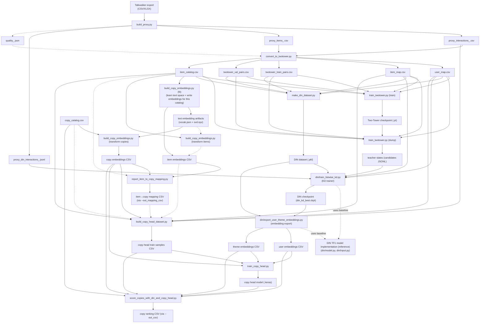

# 2. System Architecture
## 2.1 Component Overview
This pipeline is intentionally modular: each step produces a small number of inspectable artifacts (CSV / JSONL / checkpoints) that become the input contracts for the next step.

At a high level, there are three “modeling layers” and several “contract layers” around them:

- **Contract Layer A — Proxy interaction contract**: turns external observation data into an interaction-like table.
- **Contract Layer B — DIN dataset contract**: creates `dataset.pkl` with histories and categorical/theme tables.
- **Model Layer 2 — DIN listwise KD (student)**: learns a sequence-aware re-ranker by imitating teacher slates.
- **Contract Layer C — Embedding export**: materializes user/theme embeddings as CSV tables for TF2/Keras.
- **Model Layer 3 — Ad copy scoring (copy head) + global scoring**: produces proxy-supervised copy ranking scores and a final global ranking.

Below is the concrete mapping from repo scripts to architectural components.

### A) Proxy Builder (Talkwalker → proxy contract)
**Script:** `build_proxy.py`

**Responsibility**
- Normalizes messy external exports into stable, reproducible tables.
- Generates stable IDs and a pseudo-user strategy so downstream steps operate in a consistent “user/item universe.”
- Derives proxy labels and numeric proxy features from engagement signals.
- Emits a DIN-friendly JSONL with per-event history fields (may be empty).

- Produces a stable `item_id` using a hash over either URL (if present) or a (domain, normalized text snippet, date) fallback.
- Builds `user_id` via `--pseudo_user_mode` (`cohort`, `session`, or `mixed`).
- Produces two label concepts:
	- `label`: derived from `engagement_total` using either threshold or quantile logic (optionally group-normalized).
	- `label_ctr_proxy`: derived from a composite score `proxy_ctr_composite` (a weighted, re-normalized combination of volume/eng_rate/sentiment/recency proxies).

### B) Index Space & Two‑Tower Dataset Conversion
**Script:** `convert_to_twotower.py`

**Responsibility**
- Freezes the canonical dense index spaces used by all subsequent embedding-table operations.
- Produces the minimal pair tables the Two‑Tower trainer consumes.

**Key implementation details**
- Requires interactions to contain `user_id`, `item_id`, `timestamp` plus a label column (`label` or `label_ctr_proxy`).
- Creates:
	- `user_map.csv` (string `user_id` → int `user_idx`)
	- `item_map.csv` (string `item_id` → int `item_idx`)
- Splits train/val by time (globally or per-user chrono split), then performs negative sampling for training.
- Writes `item_catalog.csv` keyed by `item_idx`, optionally enriched with split-safe recency variants.

### C) Two‑Tower Retrieval (Teacher)
**Script:** `train_twotower.py`

**Responsibility**
- Trains a dot-product retrieval model over `(user_idx, item_idx)`.
- Produces teacher candidate slates for DIN KD: Top‑K item indices and their teacher scores per user.

**Model shape (from code)**
- User embedding table + item embedding table.
- Optional numeric item features (from `item_catalog.csv`) are passed through an MLP and combined with item embeddings (sum or concat+projection).
- Training objective: pointwise BCE on logits (with optional embedding regularization).

**Teacher slate output**
- The KD stage consumes `tt_candidates_topK.jsonl` lines with:
	- `user_idx`
	- `candidate_item_idx[]`
	- `candidate_scores[]` (either dot scores or sigmoid scores, depending on `--dump_score_type`)

### D) DIN Dataset Builder (Contract)
**Script:** `make_din_dataset.py`

**Responsibility**
- Converts either pair tables or proxy JSONL into the legacy DIN pickle format `dataset.pkl`.

**What `dataset.pkl` contains**
- `train_set`, `test_set`: event-level examples with per-user histories
- `cate_list`, `theme_list`: per-item categorical/theme tables aligned to `item_idx`
- `(n_users, n_items, cate_count, theme_count)` metadata

**Why this exists**
- The DIN implementation in this repo is a TF1-style graph model expecting a specific pickle payload.

### E) DIN Listwise KD Trainer (Student)
**Script:** `din/train_listwise_kd.py`
**Responsibility**
- Trains a sequence-aware model (DIN) to imitate the teacher’s Top‑K distribution for each user.

**How KD is wired (from code)**
- KD trainer provides `cand_ids` (Top‑K indices) and a teacher distribution `teacher_q` built from teacher scores and a temperature-like scaling `tau`.
- The total loss is a weighted mixture of:
	- KD loss (KL divergence) against the teacher distribution,
	- listwise CE over positives if positives are available,
	- plus the DIN model’s original pointwise BCE loss (weighted by `--point_loss_weight`).

### F) Embedding Export (DIN → tables for TF2/Keras)
**Script:** `din/export_user_theme_embeddings.py`

**Responsibility**
- Exports `user_emb_w` and `theme_emb_w` from the DIN checkpoint into CSV tables with `emb_*` columns.

**Key architectural constraint**
- The exported `user_id` / `theme_id` in these CSVs are embedding row indices (dense integer IDs), and they must align with the IDs used when building copy-head samples.

### G) Text Embedding Builder (Copy embeddings)
**Script:** `build_copy_embeddings.py`

**Responsibility**
- Builds a lightweight text embedding space using TF‑IDF + TruncatedSVD.
	- `fit`: learns vocab/IDF/SVD components and writes artifacts.
	- `transform`: projects new text rows into the already learned space.

**Practical note**
- The TF‑IDF tokenizer used here is regex-based and is most effective for Latin/ASCII-like tokens.

**Why this matters for the architecture**
- Item texts and copy texts can be embedded into the same vector space (if projected with the same artifacts), enabling item→copy mapping by cosine similarity.
- In practice, this means:
	- then run `build_copy_embeddings.py --mode transform` on `twotower_data/item_catalog.csv` (e.g., `--id_col item_idx --text_col text`) with the same `--artifact_prefix` to produce `item_embeddings.csv`.

### H) Item ↔ Copy Bridge (nearest text mapping)
**Script:** `report_item_to_copy_mapping.py`

**Responsibility**
- Computes cosine similarity between item embeddings and copy embeddings.
- Reports mapping quality statistics (and can optionally persist the mapping as a CSV).

**Optional**
- You do not need to run this script for training/scoring.
	- The copy-head dataset builder can do nearest-text mapping directly.
	- Run this mainly to inspect mapping quality and/or persist an `item_to_copy_map.csv` so you can filter by `sim`/`sim_gap`.

### I) Copy‑Head Dataset Builder (supervised samples)
**Script:** `build_copy_head_dataset.py`

**Responsibility**
- Turns proxy interactions into supervised samples over `(user_id, theme_id, copy_id)`.
- Supports two mapping strategies from item to copy:
	- `direct`: use an explicit mapping from a copy catalog.
	- `nearest_text`: map each item to the nearest copy in embedding space.
	- Recommended default: `nearest_text`. Use `direct` only when you have verified the ID universe match.
- Positives are selected by thresholds over one or more columns (e.g., by `label` and/or `engagement_total`).
- Negatives are generated by sampling other copies (`--num_neg_per_pos`).
- Optionally adds `sample_weight`.

### J) Copy‑Head Model (TF2/Keras)
**Scripts:** `train_copy_head.py`, `copy_head_model.py`

**Responsibility**
- Trains a small MLP to predict whether a given `(user_emb, theme_emb, copy_emb)` triple is positive.

**Model shape (from code)**
- Inputs: `user_emb`, `theme_emb`, `copy_emb`.
- Computes `delta = copy_emb - theme_emb`, then concatenates `[user_emb, theme_emb, delta]`.
- MLP over that concatenated vector → sigmoid probability.

### K) Global Copy Scoring (operational output)
**Script:** `score_copies_with_din_and_copy_head.py`

**Responsibility**
- Produces the final global copy ranking by:
	1) building per-theme “contexts” from training positives (weighted average of user embeddings),
	2) scoring every copy under each theme context using the copy-head model,
	3) aggregating scores across themes using a smoothed weighting scheme.

This is the stage that emits the final ranking artifact (CSV if `--out_csv` is provided).

**How to use the output**
- If you want a single default pick from the global ranking, start with the `rank == 1` row in the ranking CSV you wrote (e.g., `final_ranking.csv`).
- This ranking is **global** (aggregated across themes via weighted mixing); it is not intended to be per-user personalized.

## 2.2 Data Flow by Step
This section describes the data flow as a sequence of contracts. Each step lists:
- **Input contract** (files + required columns),
- **Output contract** (files + key columns),
- **Join keys / invariants** (what must align to avoid silent mismatches).

### Step 1 — External export → proxy tables
**Input**
- Talkwalker export file: CSV or XLSX (see `build_proxy.py` loader).

**Processing (high level)**
- Column normalization (snake_case), text assembly, timestamp parsing.
- Stable `item_id` creation.
- Pseudo-user assignment.
- Proxy feature computation (`proxy_*`) and label computation (`label`, `label_ctr_proxy`).
- Per-event history construction for DIN JSONL.

**Outputs**
- `proxy_items_<tag>.csv`: keyed by `item_id`.
- `proxy_interactions_<tag>.csv`: interaction-like table keyed by (`user_id`, `item_id`, `timestamp`).
- `proxy_din_interactions_<tag>.jsonl`: per-event JSON objects containing `hist_item_ids` and `hist_len`.

**Key invariant**
- `item_id` and `user_id` here define the semantic universe from which all later dense indices are derived.

### Step 2 — Proxy IDs → dense index universe
**Input**
- `proxy_interactions_<tag>.csv` must contain `user_id`, `item_id`, `timestamp` and one of the label columns.
- `proxy_items_<tag>.csv` must contain `item_id`.

**Outputs** (written to `twotower_data/` by default)
- `user_map.csv` (`user_id` → `user_idx`)
- `item_map.csv` (`item_id` → `item_idx`)
- `twotower_train_pairs.csv` / `twotower_val_pairs.csv` with columns (`user_idx`, `item_idx`, `label`)
- `item_catalog.csv` keyed by `item_idx` (and often still carrying `item_id` as a reference column)

**Key invariants**
- From this point on, the “IDs” used to index embeddings are dense indices:
	- Two‑Tower uses `user_idx`/`item_idx`.
	- DIN and copy-head stages depend on tables aligned to these indices.

### Step 3 — Two‑Tower training and teacher slate dump
**Input**
- Pair tables: `twotower_train_pairs.csv`, `twotower_val_pairs.csv`.
- Maps: `user_map.csv`, `item_map.csv`.
- Optional item features: `item_catalog.csv`.

**Outputs**
- Optional checkpoints/metrics (controlled by flags).
- `tt_candidates_topK.jsonl` when `--dump_candidates_k > 0`.

**Key invariant**
- Candidate slates are expressed in `item_idx` and must match the `item_count` and `user_count` implied by the maps and the DIN dataset.

### Step 4 — Build `dataset.pkl` for DIN
**Input options**
- Option A: `twotower_train_pairs.csv` + `twotower_val_pairs.csv`.
- Option B: `proxy_din_interactions_<tag>.jsonl`.
- In both cases, the standard (theme-aware) pipeline also provides `item_catalog.csv` + `--theme_col` so `theme_list/theme_count` are meaningful.

**Output**
- `din/dataset.pkl` (default path).

**Key invariant**
- The `item_idx` space embedded into `cate_list`/`theme_list` must match the `item_map.csv` produced earlier.
- If you plan to use theme-aware downstream steps (export `theme_embeddings.csv`, train copy-head with non-trivial `theme_id`), build `dataset.pkl` with the same `item_catalog.csv` + `--theme_col` so `theme_count` matches the theme IDs used later.

### Step 5 — DIN listwise KD training
**Inputs**
- `din/dataset.pkl`
- `tt_candidates_topK.jsonl`
- `user_map.csv`, `item_map.csv`

**Outputs**
- `din_kd_runs/din_kd_best.ckpt`

**Key invariant**
- KD uses teacher candidates per `user_idx`. Any mismatch in user indexing will cause users to be dropped or mis-trained.

### Step 6 — Export DIN embeddings
**Inputs**
- `din/dataset.pkl`
- `din_kd_best.ckpt` (or any DIN checkpoint)

**Outputs**
- `user_embeddings.csv` with `user_id` + `emb_*`
- `theme_embeddings.csv` with `theme_id` + `emb_*`

**Key invariant**
- These exported integer IDs are embedding-table row indices.

### Step 7 — Build text embeddings (copy + item; used by nearest-text item→copy mapping)
**Inputs**
- A CSV containing an ID column and a text column.
	- Typical: `copy_catalog.csv` with `copy_id`, `copy_text`.
	- Also possible: `twotower_data/item_catalog.csv` with `item_idx`, `text`.

**Outputs**
- `copy_embeddings.csv` and `item_embeddings.csv` with `id_col` + `emb_*` (in the same text space).
- Artifact files used to keep the embedding space consistent across fit/transform.

**Key invariant**
- If you want to compare or map items and copies in the same text space, generate both embedding tables using the same `--artifact_prefix`: run `fit` on one catalog and `transform` on the other.

### Step 8 — (Optional) persist item→copy mapping
**Inputs**
- `item_embeddings.csv` + `copy_embeddings.csv`

**Outputs**
- Optional mapping CSV: `item_idx, copy_id, sim, sim_gap`

### Step 9 — Build ad copy scoring training samples (copy-head)
**Inputs**
- Proxy interactions CSV.
- `user_map.csv`, `item_map.csv`, and `item_catalog.csv` (to compute `user_id`/`theme_id` indices and theme mapping).
- Item→copy linkage (choose one; depends on flags):
	- `--item_to_copy=nearest_text`: requires `item_embeddings.csv` + `copy_embeddings.csv` (same text space)
	- `--item_to_copy_map_csv`: a precomputed mapping CSV (`item_idx, copy_id[, sim, sim_gap]`)
	- `--item_to_copy=direct`: requires `copy_catalog.csv` containing `copy_catalog_item_col` and `copy_catalog_id_col`
	- Recommended default: `nearest_text` unless you have a verified explicit item→copy mapping.

**Outputs**
- Copy-head sample CSV with columns:
	- `user_id` (dense index)
	- `theme_id` (dense index)
	- `copy_id` (dense index)
	- `label` (float)
	- optional `sample_weight`

### Step 10 — Train ad copy scoring model (copy-head) and score copies
**Inputs**
- Embedding tables: user/theme/copy.
- Copy-head training samples CSV.

**Outputs**
- Keras model file (e.g., `copy_head.keras`).
- Optional ranking CSV (if `--out_csv` is provided).

## 2.3 Dependency Graph & External Requirements
This pipeline spans multiple ML stacks (PyTorch + TF graph mode + TF2/Keras) and relies on a small set of external inputs.

### Internal dependency graph (artifact contracts)
The arrows represent “artifact contracts”, not in-memory calls.

Conventions:
- Solid arrows: required in the default/recommended path shown here.
- Dashed arrows: optional or alternative inputs depending on CLI flags (e.g., proxy JSONL vs pairs, precomputed mapping vs nearest-text mapping).
- Dashed arrows with label `uses baseline`: code-level dependency on an external reference implementation (import/usage), not an artifact contract.

Attribution boundary:
- **Implemented in this repo**: the end-to-end pipeline and all training/export/scoring jobs.
- **Also implemented in this repo (these files live under `din/`)**:
	- `din/train_listwise_kd.py` (listwise KD trainer)
	- `din/export_user_theme_embeddings.py` (embedding export)
- **Reference-derived code is limited to 2 files under `din/`** (DIN TF1 model implementation; reference: https://github.com/zhougr1993/DeepInterestNetwork):
	- `din/model.py`
	- `din/input.py`

### External input requirements
- **Talkwalker export**: CSV or XLSX supported by `build_proxy.py`.
- **Copy catalog (ad copy candidates)**: a CSV containing at least an ID column and a text column (defaults are `copy_id`, `copy_text`).

### Runtime / library requirements (by stage)
The canonical dependency list is in `requirements.txt`. Architecturally:

- **Proxy + conversion steps** (`build_proxy.py`, `convert_to_twotower.py`, `make_din_dataset.py`)
	- pandas / numpy, plus `openpyxl` for XLSX.
- **Two‑Tower (PyTorch)** (`train_twotower.py`)
	- torch (+ optional GPU/MPS acceleration depending on the machine).
- **DIN KD (TF graph mode)** (`din/train_listwise_kd.py`, `din/model.py`, `din/input.py`)
	- TensorFlow running in `tf.compat.v1` graph/session mode.
	- Practical note: because this is a TF1-style graph workflow, environment constraints can be stricter on Apple Silicon depending on the TensorFlow build you use.
- **Ad copy scoring (TF2/Keras)** (implemented as a copy-head + scorer: `train_copy_head.py`, `copy_head_model.py`, `score_copies_with_din_and_copy_head.py`)
	- TensorFlow/Keras.
	- The training/scoring scripts explicitly hide GPUs via `tf.config.experimental.set_visible_devices([], "GPU")` to keep runtime predictable.
- **Text embeddings** (`build_copy_embeddings.py`)
	- scipy sparse + scikit-learn (TruncatedSVD).

If you want a single “mental” dependency rule: the pipeline is only as consistent as its index spaces.
Keep `user_map.csv`, `item_map.csv`, `din/dataset.pkl`, and exported embedding CSVs from the same run/tag together.

